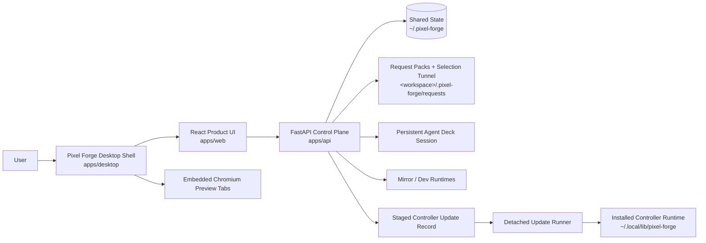
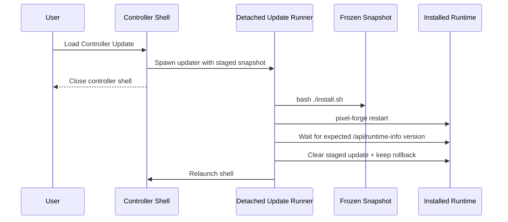
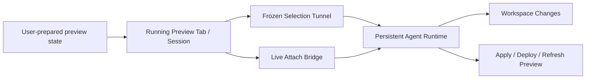
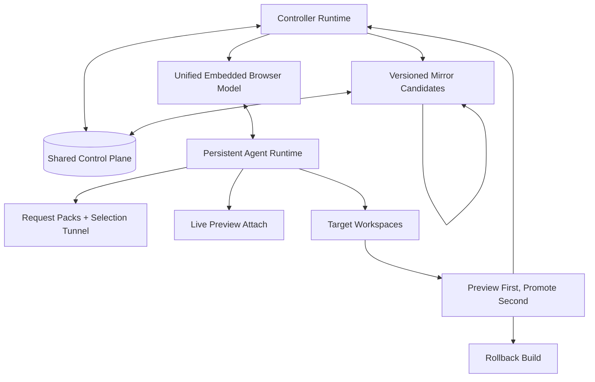

# Architecture

This is the only active repo-level architecture and operating doc.

- `SPECS.md` owns intent, goals, requirements, limiting factor, and proof status.
- `ARCHITECTURE.md` owns current system shape, next target release shape, final ideal shape, and the operating lanes that still deserve to exist.
- `AGENTS.md` and `CLAUDE.md` should only contain non-inferable agent guardrails.
- Historical and displaced root docs live under `docs/archives/root-docs/`.

## Operating Lanes

### Development

Preferred path:

```bash
./start-dev.sh
```

That starts the API, the Vite frontend, and auto-opens the desktop shell when a GUI display is available.

Manual fallback:

```bash
cd apps/api
python3 -m venv .venv
.venv/bin/pip install -r requirements.txt
.venv/bin/python main.py

cd apps/web
pnpm install
pnpm dev
```

### Installed Controller App

```bash
./install.sh
pixel-forge open
```

### Verification

```bash
pnpm verify
```

This is the canonical proof lane for version sync, shell syntax, API/desktop/web health, isolated install smoke, and staged controller-update apply/rollback smoke.

### Controller Update Management

```bash
pixel-forge stage-update --project /abs/path --summary "Update ready to load"
pixel-forge show-update
pixel-forge clear-update
```

If the install/update lane changed after a controller update was staged, clear and restage it from current repo truth instead of applying the stale snapshot.

## Current State

Current architectural facts:

- The product path is the desktop shell over the installed FastAPI backend and built frontend.
- The browser-only web path is a debug/service fallback, not the supported Live Editor preview surface.
- Shared control-plane truth lives under `~/.pixel-forge` for projects, resumable sessions, staged controller updates, and mirror instance metadata.
- Live Editor writes request packs into the target workspace and dispatches a short prompt into a persistent Agent Deck session.
- Mirror runtimes are isolated sibling Pixel Forge instances keyed by source snapshot or runtime root. `Run Pixel Forge` defaults to the latest available mirror candidate for the workspace, with staged snapshots preferred when one exists.
- Controller updates stage a frozen snapshot, hand off to a detached updater, reinstall from that frozen source, restart through the installed launcher, wait for the expected controller version, relaunch the shell, and keep a rollback build.

### Current System Diagram



### Current Controller Update Flow



## Next Target Release

The next target release should attack the current limiting factor from `SPECS.md`: agent handoff fidelity is still weaker than the preview/session fidelity Pixel Forge already captures.

The smallest complete unit that matters now:

- keep the frozen request-pack and selection-tunnel lane as the minimum truthful handoff
- add a live attach lane into the already-running preview tab or browser session when deeper inspection is needed
- make deploy/apply expectations follow the active preview target truth instead of repo-only inference
- keep the staged update and mirror architecture intact while strengthening the agent-side connection to the live surface

### Next Target Release Diagram



## Final Ideal State

The final ideal state is a boring, recursive, truthful loop:

- one embedded browser model for localhost, remote sites, and Pixel Forge itself
- one shared control plane for controller and mirror runtimes
- one agent runtime that can use both frozen evidence and live attach into the prepared preview session
- one promotion path from mirror preview candidate to installed controller, with rollback if needed
- recursion stays faithful because mirrors are real Pixel Forge runtimes, not special target-only surrogates

### Final Ideal State Diagram



## What No Longer Earns Active Space

- separate quick-start and setup docs
- progress or vision docs that duplicate `SPECS.md` or this file
- test-run narratives that are just historical execution logs
- root-level summaries or findings docs that are no longer operational truth

Those belong in `docs/archives/root-docs/`, not in the active root doc surface.
