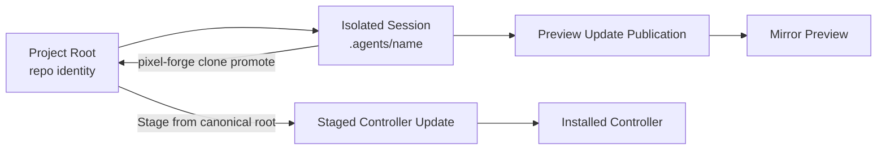
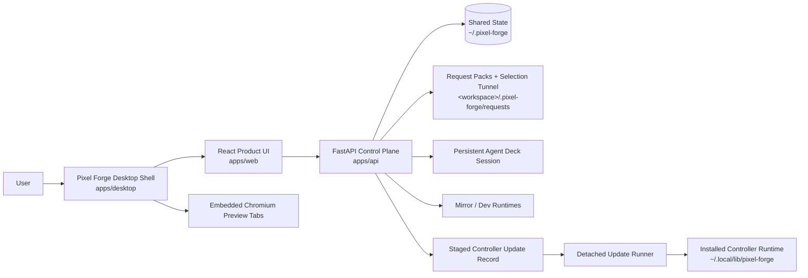
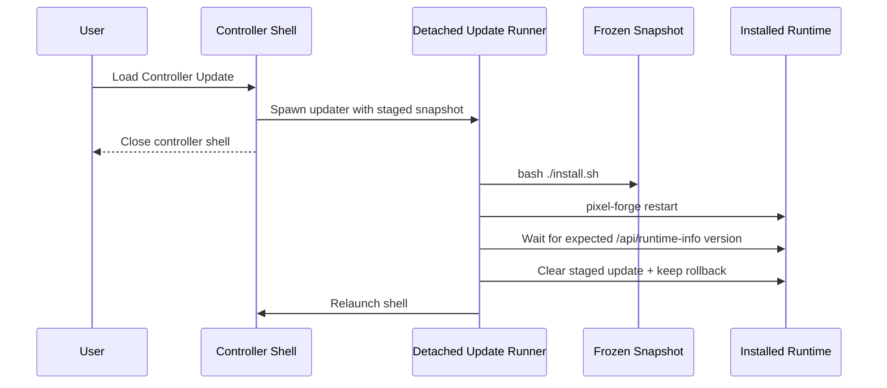
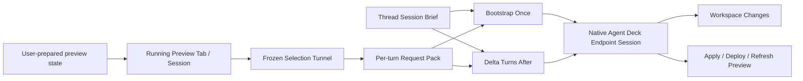
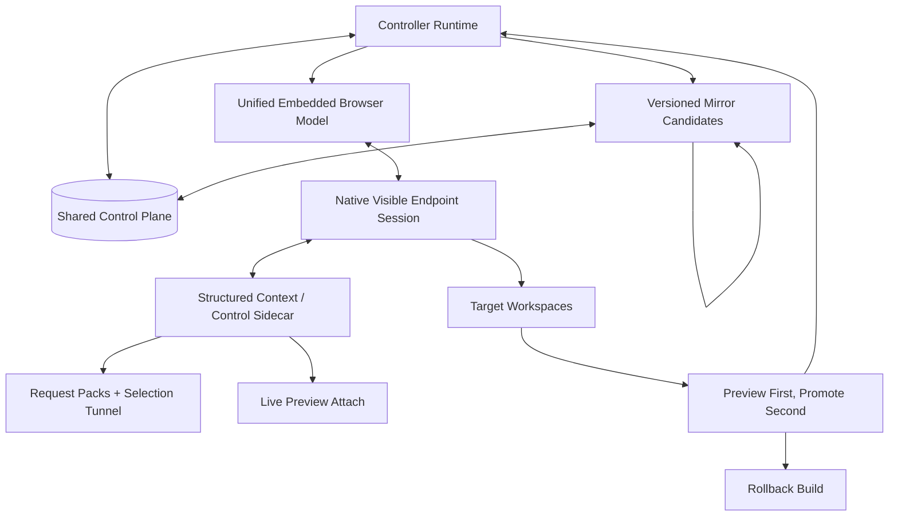

# Architecture

This is the only active repo-level architecture and operating doc.

- `SPECS.md` owns intent, goals, requirements, limiting factor, and proof status.
- `ARCHITECTURE.md` owns current system shape, next target release shape, final ideal shape, and the operating lanes that still deserve to exist.
- `docs/adr/` owns durable design rationale that should survive implementation churn.
- `AGENTS.md` and `CLAUDE.md` should only contain non-inferable agent guardrails.
- Historical and displaced root docs live under `docs/archives/root-docs/`.

## Operating Lanes

### Development

Preferred path:

```bash
./start-dev.sh
```

That starts the API, the Vite frontend, and auto-opens the desktop shell when a GUI display is available.

Manual fallback:

```bash
cd apps/api
python3 -m venv .venv
.venv/bin/pip install -r requirements.txt
.venv/bin/python main.py

cd apps/web
pnpm install
pnpm dev
```

### Installed Controller App

```bash
./install.sh
pixel-forge open
```

### Verification

```bash
pnpm verify
```

This is the canonical proof lane for version sync, shell syntax, API/desktop/web health, isolated install smoke, and staged controller-update apply/rollback smoke.

### Controller Update Management

```bash
pixel-forge controller-update stage --project /abs/path --git-ref HEAD --summary "Update ready to load"
pixel-forge controller-update status
pixel-forge controller-update apply
pixel-forge controller-update clear

pixel-forge clone promote <session> --into master --commit --push --stage
```

The installed `pixel-forge` launcher and the Pixel Forge repo-local `./pixel-forge` wrapper both dispatch to the same canonical command definition. Use `--git-ref` when the source should be an exact local commit instead of the mutable filesystem working tree. By default controller updates stage only from the canonical project root; clone workspaces under `.agents/` remain preview/edit sandboxes unless the operator explicitly overrides that policy. If the install/update lane changed after a controller update was staged, clear and restage it from current repo truth instead of applying the stale snapshot. Legacy aliases `stage-update`, `show-update`, `clear-update`, `apply-update`, and `promote-clone` still exist as compatibility shims, but the nested commands above are the canonical surface.
When developing Pixel Forge itself from the repo checkout, the repo-local `./pixel-forge` wrapper is the source-of-truth dev lane for stage/apply until the installed launcher has itself been refreshed to the latest CLI surface.

## Current System Shape

- The product path is the desktop shell over the installed FastAPI backend and built frontend.
- The browser-only web path is a debug/service fallback, not the supported Live Editor preview surface.
- Shared control-plane truth lives under `~/.pixel-forge` for projects, resumable sessions, staged controller updates, clone-scoped preview-update publications, and mirror instance metadata.
- Embedded preview input ownership is explicit controller state: visible tab, focused surface, and armed tool are separate facts. Showing a preview or arming a tool does not by itself focus the preview.
- Live Editor writes request packs into the bound workspace and dispatches into a persistent native Agent Deck endpoint session.
- The Projects sidebar and advanced Settings retarget control now render one reconciled Pixel Forge chat model per project. Persisted lanes remain authoritative, visible Agent Deck sessions are reconciliation inputs, unmatched live sessions are adopted into chat rows before they appear, and fresh isolated chats are created through that same chat-facing surface instead of a raw-session picker.
- Fresh Live Editor chats provision isolated Agent Deck clone workspaces under the project `.agents/` tree up front while the canonical repo root remains the project identity.
- One Live Editor thread owns one Agent Deck lane, one default writable workspace root, and one thread-scoped editor surface: preview tabs, active target URL, viewport/tool state, selection/history state, and chat state all move together. The default self-edit mirror source follows that same bound workspace.
- The shared session store persists the durable subset of that thread editor surface, including tab descriptors and restore metadata, and the UI reacquires runtime-only browser handles when a lane is reopened instead of pretending old handles survived a restart.
- The shared control-plane store also keeps one default operator profile pointer for ordinary app reopen: last active project, active mode, and active Live Editor thread. Controller-update bootstrap relaunch is an override path, not the only restore path.
- If an Agent Deck session disappears outside Pixel Forge, the control-plane store detaches that dead binding from the persisted lane instead of hiding or deleting the lane. Workspace pointers and durable editor state survive; when that saved workspace still exists, the next backend reattach should target that same lane workspace rather than silently minting a second clone.
- Agent Deck session ownership is exclusive at the Live Editor thread level. If one thread already owns a session, another thread must switch to that thread or create a different session instead of sharing the lane.
- Live Editor handoff has two prompt shapes: bootstrap on the first turn for a new or rebound endpoint session, then delta-only framing for later turns on that same visible session.
- Stable Live Editor workflow rules live in a thread-level `session-brief.md`, while each per-turn `request.md` carries the new delta context for that turn.
- Explicit slash-skill requests are promoted out of freeform user prose into a dedicated request-pack `## Skills` section, and the dispatch wrapper treats them as invoke-now instructions instead of optional hints.
- Slash-skill autocomplete and skill visibility come from scanning the real skill folder trees on disk: the managed Pixel Forge skill home plus external agent skill homes like Claude, Codex, and OpenClaw. The managed Pixel Forge skill home lives under `~/.pixel-forge`, not inside the mutable app install tree, so reinstalling Pixel Forge does not wipe the skill surface.
- Mirror runtimes are isolated sibling Pixel Forge instances keyed by source snapshot or runtime root. The primary mirror-launch control binds to the isolated Live Editor workspace source and creates an isolated clone when needed.
- Controller updates stage a frozen snapshot, optionally from an exact local git ref, through one shared CLI surface.
- Controller installs default to canonical-root sources only. Clone workspaces under `.agents/` are preview/edit sandboxes until they are promoted back into the canonical root or the operator explicitly opts into a noncanonical source.
- Clone-backed self-edit completions publish preview-only frozen snapshots scoped to the bound clone/session. Loading that update launches a distinct mirror candidate in a new tab instead of rebuilding over the current preview tab.

### Simple Working Model

Use these identities consistently:

- `project root`: the canonical repo identity the operator chose
- `isolated session`: the clone-backed working copy under `.agents/<name>`
- `lane`: the thread-owned binding of Agent Deck session, writable workspace, and thread-scoped editor/chat state
- `mirror`: a runnable Pixel Forge preview built from one source root or frozen clone snapshot
- `staged update`: the frozen controller-install candidate
- `controller`: the installed runtime under `~/.local/lib/pixel-forge`

The intended loop is:



The important boundary is:

- clone creation starts from local git state, not raw working-tree copying
- request packs, direct edits, and committed selections happen in the bound thread lane workspace
- clone preview publication freezes a clone snapshot per session and loads that snapshot into a new mirror tab
- controller install reads from the staged frozen snapshot, not the live repo

### Current Handoff Lanes

#### Native Endpoint Lane

- Agent Deck owns the visible native `claude` or `codex` session.
- Pixel Forge owns visual context capture, request-pack writing, selection tunnel generation, and routing to the chosen Agent Deck session.
- The first dispatch into a new or rebound session includes the stable Pixel Forge bootstrap framing and points at the thread's stable `session-brief.md`.
- Later dispatches into that same session send only the new request-pack reference and turn-specific context while reusing that stable thread brief.
- Streaming comes from the native agent transcript path (`claude_session_id` + JSONL today for Claude).
- Codex/native non-JSONL sessions are still on the degraded transparency path: heartbeat plus real completion today, transcript adaptation later.
- When a native session cannot provide a truthful stream surface, Pixel Forge still uses Agent Deck's ready-gated send path, then polls completion itself and emits periodic status heartbeats instead of treating the CLI's completion timeout as the UI truth.

#### ACPX Sidecar Lane

- ACPX is available as a version-pinned structured runtime/control layer for experiments, legacy wrapper sessions, and future richer transport work.
- ACPX resumes ACP-created sessions well.
- ACPX is not the default continuity owner for the already-running native Agent Deck endpoint session the operator sees.

### Tooling Map

| Layer | Useful | Not Enough Yet | What Unlocks Deeper Integration |
|---|---|---|---|
| Pixel Forge request packs + selection tunnel | Truthful frozen context, inspectable disk artifacts, good delta payload carrier, stable session brief plus per-turn request delta | Still file-first and indirect once a native session is already warm | Richer artifact references, structured context updates, eventual live attach |
| Agent Deck native sessions | Real operator control, real takeover of Claude/Codex, session visibility | Mostly terminal/transcript surface, limited structured context injection | Better session metadata hooks, stronger transcript/event surfaces |
| ACPX 0.3.1 | Structured prompting, queueing, cancel, typed tool events, persistent ACP-owned sessions, pinned upstream foundation for future sidecar work | No proven attach/load path for an already-running native Agent Deck Claude/Codex session | Attach/import existing native agent session, context update primitives, session metadata sync |
| Pixel Forge skill/CLI | Stable agent-facing way to read captured state | Still file-oriented and indirect | Direct artifact/context item transport on top of the same truthful capture model |

### Upstream Capability Gap

The ideal future ACPX-backed integration does not require ACPX to replace request packs or native Agent Deck sessions. It requires ACPX to complement them.

The specific upstream capabilities that would unlock that fuller architecture are:

- attach or import an already-running native agent session instead of only resuming ACP-created sessions
- stable mapping between ACP session id and native agent session id that can be adopted after the native session already exists
- structured prompt/update or context-patch calls that let Pixel Forge send new per-turn context without replaying the full bootstrap framing
- first-class artifact/context-item references for things like selection tunnel files, screenshots, and preview metadata
- session-side memory or note primitives so stable Pixel Forge setup context can be written once and reused naturally across turns
- transcript/event surfaces that stay aligned with the native visible endpoint session instead of a separate hidden sidecar conversation

### Current System Diagram



### Current Controller Update Flow



## Next Target Release

The next target release should attack the current limiting factor from `SPECS.md`: the context transport is still more file-oriented and indirect than the eventual sidecar path should be.

The smallest complete unit that matters:

- keep the frozen request-pack and selection-tunnel lane as the minimum truthful handoff
- trust visible-session continuity and stop repeating stable setup framing on every turn
- keep the first-turn bootstrap brief stable and keep later turns request-delta-focused
- make deploy/apply expectations follow the active preview target truth instead of repo-only inference
- keep ACPX pinned and available as an upstream sidecar candidate without forcing it into the visible endpoint lane before shared-session attach exists

### Next Target Release Diagram



## Final Ideal State

The final ideal state is a boring, recursive, truthful loop:

- one embedded browser model for localhost, remote sites, and Pixel Forge itself
- one shared control plane for controller and mirror runtimes
- one native visible endpoint session with a richer sidecar transport layer that can use both frozen evidence and live attach into the prepared preview session
- one promotion path from mirror preview candidate to installed controller, with rollback if needed
- recursion stays faithful because mirrors are real Pixel Forge runtimes, not special target-only surrogates

### Final Ideal State Diagram



## What No Longer Earns Active Space

- separate quick-start and setup docs
- progress or vision docs that duplicate `SPECS.md` or this file
- test-run narratives that are just historical execution logs
- root-level summaries or findings docs that are no longer operational truth

Those belong in `docs/archives/root-docs/`, not in the active root doc surface.
