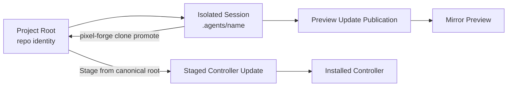
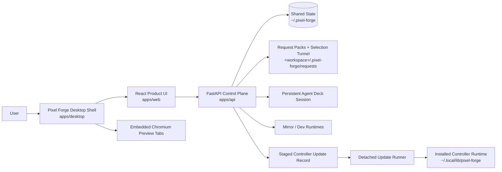
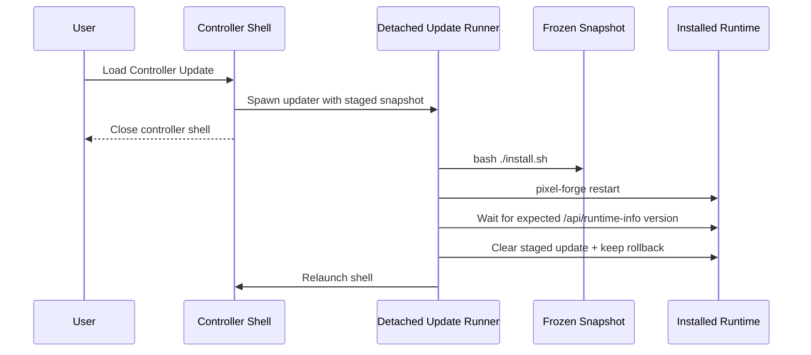
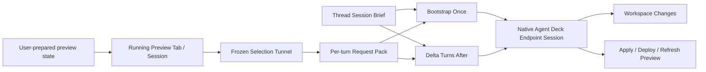
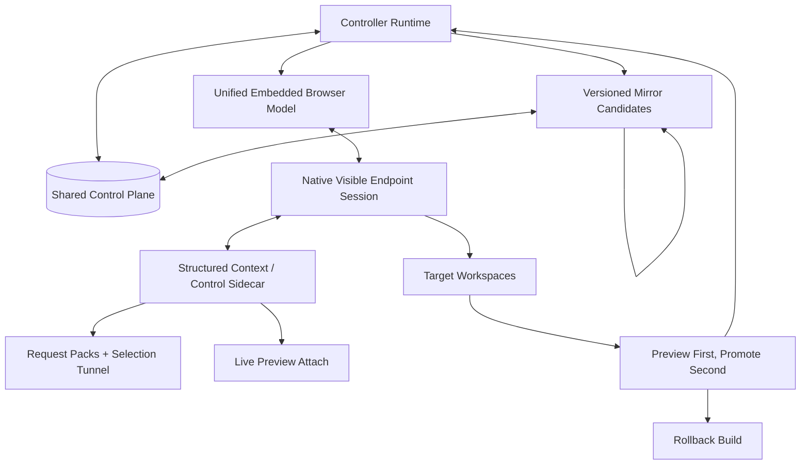

# Architecture

This is the only active repo-level architecture and operating doc.

- `SPECS.md` owns intent, goals, requirements, limiting factor, and proof status.
- `ARCHITECTURE.md` owns current system shape, next target release shape, final ideal shape, and the operating lanes that still deserve to exist.
- `docs/adr/` owns durable design rationale that should survive implementation churn.
- `AGENTS.md` and `CLAUDE.md` should only contain non-inferable agent guardrails.
- Historical and displaced root docs live under `docs/archives/root-docs/`.

## Operating Lanes

### Development

Preferred path:

```bash
./start-dev.sh
```

That starts the API, the Vite frontend, and auto-opens the desktop shell when a GUI display is available.

Manual fallback:

```bash
cd apps/api
python3 -m venv .venv
.venv/bin/pip install -r requirements.txt
.venv/bin/python main.py

cd apps/web
pnpm install
pnpm dev
```

### Installed Controller App

```bash
./install.sh
pixel-forge open
```

### Verification

```bash
pnpm verify
```

This is the canonical proof lane for version sync, shell syntax, API/desktop/web health, isolated install smoke, and staged controller-update apply/rollback smoke.

### Controller Update Management

```bash
pixel-forge controller-update stage --project /abs/path --git-ref HEAD --summary "Update ready to load"
pixel-forge controller-update status
pixel-forge controller-update apply
pixel-forge controller-update clear

pixel-forge clone promote <session> --into master --commit --push --stage
```

The installed `pixel-forge` launcher and the Pixel Forge repo-local `./pixel-forge` wrapper both dispatch to the same canonical command definition. Use `--git-ref` when the source should be an exact local commit instead of the mutable filesystem working tree. By default controller updates stage only from the canonical project root; clone workspaces under `.agents/` remain preview/edit sandboxes unless the operator explicitly overrides that policy. If the install/update lane changed after a controller update was staged, clear and restage it from current repo truth instead of applying the stale snapshot. Legacy aliases `stage-update`, `show-update`, `clear-update`, `apply-update`, and `promote-clone` still exist as compatibility shims, but the nested commands above are the canonical surface.
When developing Pixel Forge itself from the repo checkout, the repo-local `./pixel-forge` wrapper is the source-of-truth dev lane for stage/apply until the installed launcher has itself been refreshed to the latest CLI surface.

## Current System Shape

- The product path is the desktop shell over the installed FastAPI backend and built frontend.
- The browser-only web path is a debug/service fallback, not the supported Live Editor preview surface.
- Shared control-plane truth lives under `~/.pixel-forge` for projects, resumable sessions, staged controller updates, clone-scoped preview-update publications, and mirror instance metadata.
- Embedded preview input ownership is explicit controller state: visible tab, focused surface, and armed tool are separate facts. Showing a preview or arming a tool does not by itself focus the preview.
- Live Editor writes request packs into the bound workspace and dispatches into a persistent native Agent Deck endpoint session.
- The Projects sidebar and advanced Settings retarget control now render one reconciled Pixel Forge chat model per project. Persisted lanes remain authoritative, visible Agent Deck sessions are reconciliation inputs, unmatched live sessions are adopted into chat rows before they appear, and fresh chats are created through that same chat-facing surface as draft lanes instead of a raw-session picker.
- Project rows are stable-position records, not recency-sorted entries. Activating a project updates profile/session state but does not move that project to the top of the sidebar.
- Fresh Live Editor chats now start as unbound drafts. They carry only intended agent state until the first real bind, and that first bind creates the isolated Agent Deck clone workspace under the project `.agents/` tree while the canonical repo root remains the project identity.
- The sidebar `+ New chat` path is local-first. Clicking it opens or reuses a local draft lane instead of eagerly persisting a blank managed root chat record, and reconciled project chats intentionally suppress legacy detached root drafts that still have only the default empty editor shell.
- One Live Editor thread owns one Agent Deck lane, one default writable workspace root, and one thread-scoped editor surface: preview tabs, current browsing URL, one optional explicit target preview tab, viewport/tool state, selection/history state, and chat state all move together. The default self-edit mirror source follows that same bound workspace.
- Preview sandbox ownership follows the workspace plus its launch contract, not the chat. New chats usually create new workspaces, so the default product behavior is still one sandbox per chat, but any later chat that reuses an existing workspace and the same preview contract must also reuse that workspace sandbox instead of starting a second local runtime by default. If one workspace exposes multiple declared preview adapters, each adapter-backed launch lane is its own reusable sandbox and Pixel Forge must not silently reuse the wrong one.
- When a repo has not declared a preview adapter yet, bounded heuristic fallback should still key runtime identity off the inferred launch plan rather than collapsing every undeclared surface in that workspace onto one default preview lane. If that bounded inference still leaves multiple equally plausible local preview surfaces, Pixel Forge should stop and surface the ambiguity with starter adapter guidance instead of silently choosing one.
- The shared session store persists the durable subset of that thread editor surface, including tab descriptors and restore metadata, and the UI reacquires runtime-only browser handles when a lane is reopened instead of pretending old handles survived a restart.
- The shared control-plane store also keeps one default operator profile pointer for ordinary app reopen: last active project, active mode, active Live Editor thread, and the persistent default-agent preference. Claude Code is the default until the operator changes it. Controller-update bootstrap relaunch is an override path, not the only restore path.
- If an Agent Deck session disappears outside Pixel Forge, the control-plane store detaches that dead binding from the persisted lane instead of hiding or deleting the lane. Workspace pointers and durable editor state survive; when that saved workspace still exists, the next backend reattach should target that same lane workspace rather than silently minting a second clone.
- Agent Deck session ownership is exclusive at the Live Editor thread level. If one thread already owns a session, another thread must switch to that thread or create a different session instead of sharing the lane.
- Live Editor handoff has two prompt shapes: bootstrap on the first turn for a new or rebound endpoint session, then delta-only framing for later turns on that same visible session.
- Stable Live Editor workflow rules live in a thread-level `session-brief.md`, while each per-turn `request.md` carries the new delta context for that turn.
- Explicit slash-skill requests are promoted out of freeform user prose into a dedicated request-pack `## Skills` section, and the dispatch wrapper treats them as invoke-now instructions instead of optional hints.
- Slash-skill autocomplete and skill visibility come from scanning the real skill folder trees on disk: the managed Pixel Forge skill home plus external agent skill homes like Claude, Codex, and OpenClaw. The managed Pixel Forge skill home lives under `~/.pixel-forge`, not inside the mutable app install tree, so reinstalling Pixel Forge does not wipe the skill surface.
- Mirror runtimes are isolated sibling Pixel Forge instances keyed by source snapshot or runtime root. The primary mirror-launch control binds to the isolated Live Editor workspace source and creates an isolated clone when needed.
- Controller updates stage a frozen snapshot, optionally from an exact local git ref, through one shared CLI surface.
- Controller installs default to canonical-root sources only. Clone workspaces under `.agents/` are preview/edit sandboxes until they are promoted back into the canonical root or the operator explicitly opts into a noncanonical source.
- Clone-backed self-edit completions publish preview-only frozen snapshots scoped to the bound clone/session. Loading that update reuses the chat's primary mirror tab for that workspace by default, while still allowing separate mirror candidates to coexist when the operator opens them deliberately.
- Mirror launch follows the current chat as-is. Existing clone-backed chats mirror from their latest clone preview snapshot when one exists or from their bound workspace otherwise; existing canonical-root chats mirror from the latest staged controller snapshot when one exists or from the live controller runtime otherwise. Only brand-new draft chats default to clone creation.
- Clone-backed work must keep local preview isolation all the way down to localhost/dev runtimes. If a clone-backed lane opens a project-owned local preview, Pixel Forge should broker that load through a workspace-local sandbox instead of pointing multiple isolated workspaces at one shared localhost instance.
- Repo-declared workspace preview adapters are the preferred launch truth for workspace sandboxes. When a repo declares `pixel-forge.preview.json` at its workspace root, Pixel Forge should use that contract first and only fall back to bounded launch inference when a workspace has not declared one yet.
- Pixel Forge should broker repo-native local dev/watch commands where possible instead of inventing a second live-update engine. Build-and-serve is a fallback for workspaces that do not expose a truthful live local loop.
- Agent Deck's Docker sandbox is external technical debt and currently broken in that repo. Pixel Forge preview isolation must not depend on it; Pixel Forge owns workspace preview brokering, runtime reuse, and local port separation itself.
- Reconciled project chats discovered from Agent Deck are first-class Live Editor lanes even before Pixel Forge has sent its own first request. Pixel Forge should not mislabel an attached adopted chat as an empty draft; selecting one hydrates the attached session's live status/output into the lane, and follow-up sends to a currently busy attached session are queued through Agent Deck rather than failing the default readiness gate.
- Non-controller runtimes do not auto-restore persisted Pixel Forge local-target tabs on startup. That guard prevents mirror-in-mirror recursion while still preserving the tab metadata for deliberate reload.
- Non-controller runtimes keep ordinary preview capability for external apps, but they do not reopen the originating Pixel Forge workspace or launch nested Pixel Forge target runtimes inside themselves. Mirror depth for Pixel Forge itself is intentionally capped at one layer.
- Runtime identity is delivered by authoritative backend bootstrap via `/api/runtime-info`, not silently inferred from hostnames. The backend includes `runtimeKind`, `targetProjectPath`, and boolean permission flags (`allowProfileRestore`, `allowLocalTargetRestore`, `allowSelfMirrorLaunch`) derived from `PIXEL_FORGE_RUNTIME_KIND`. The frontend stores these authoritatively and uses them for all critical behavior gates. Host-based inference in `config.ts` remains as an initial/fallback value only, covering the window between page load and `/api/runtime-info` response.

### Simple Working Model

Use these identities consistently:

- `project root`: the canonical repo identity the operator chose
- `isolated session`: the clone-backed working copy under `.agents/<name>`
- `lane`: the thread-owned editor/chat state plus its eventual Agent Deck session and writable-workspace binding; draft lanes keep intended agent state before the real bind exists
- `mirror`: a runnable Pixel Forge preview built from one source root or frozen clone snapshot
- `staged update`: the frozen controller-install candidate
- `controller`: the installed runtime under `~/.local/lib/pixel-forge`

The intended loop is:



The important boundary is:

- clone creation starts from local git state, not raw working-tree copying
- request packs, direct edits, and committed selections happen in the bound thread lane workspace
- clone preview publication freezes a clone snapshot per session and reloads the primary mirror tab for that workspace by default, without removing the ability to keep multiple mirror candidates open
- controller install reads from the staged frozen snapshot, not the live repo

### Current Handoff Lanes

#### Native Endpoint Lane

- Agent Deck owns the visible native `claude` or `codex` session.
- Pixel Forge owns visual context capture, request-pack writing, selection tunnel generation, and routing to the chosen Agent Deck session.
- Fresh chats start as draft lanes with a chosen initial agent. The chat composer may change that choice only before first send; once the real lane exists, the agent choice is immutable until a fresh chat is created.
- The first dispatch into a new or rebound session includes the stable Pixel Forge bootstrap framing and points at the thread's stable `session-brief.md`.
- Later dispatches into that same session send only the new request-pack reference and turn-specific context while reusing that stable thread brief.
- Streaming comes from the native agent transcript path (`claude_session_id` + JSONL today for Claude).
- Codex/native non-JSONL sessions now adapt the best truthful stream surface available from Agent Deck session output: real text deltas become assistant chunks, progress-only lines become status updates, and completion still follows the actual Agent Deck settle state.
- When a native session still cannot provide a truthful token-like stream surface, Pixel Forge keeps using Agent Deck's ready-gated send path, polls completion itself, and emits status heartbeats instead of treating the CLI's completion timeout as the UI truth.

#### ACPX Sidecar Lane

- ACPX is available as a version-pinned structured runtime/control layer for experiments, legacy wrapper sessions, and future richer transport work.
- ACPX resumes ACP-created sessions well.
- ACPX is not the default continuity owner for the already-running native Agent Deck endpoint session the operator sees.

### Tooling Map

| Layer | Useful | Not Enough Yet | What Unlocks Deeper Integration |
|---|---|---|---|
| Pixel Forge request packs + selection tunnel | Truthful frozen context, inspectable disk artifacts, good delta payload carrier, stable session brief plus per-turn request delta | Still file-first and indirect once a native session is already warm | Richer artifact references, structured context updates, eventual live attach |
| Agent Deck native sessions | Real operator control, real takeover of Claude/Codex, session visibility | Mostly terminal/transcript surface, limited structured context injection | Better session metadata hooks, stronger transcript/event surfaces |
| ACPX 0.3.1 | Structured prompting, queueing, cancel, typed tool events, persistent ACP-owned sessions, pinned upstream foundation for future sidecar work | No proven attach/load path for an already-running native Agent Deck Claude/Codex session | Attach/import existing native agent session, context update primitives, session metadata sync |
| Pixel Forge skill/CLI | Stable agent-facing way to read captured state | Still file-oriented and indirect | Direct artifact/context item transport on top of the same truthful capture model |

### Upstream Capability Gap

The ideal future ACPX-backed integration does not require ACPX to replace request packs or native Agent Deck sessions. It requires ACPX to complement them.

The specific upstream capabilities that would unlock that fuller architecture are:

- attach or import an already-running native agent session instead of only resuming ACP-created sessions
- stable mapping between ACP session id and native agent session id that can be adopted after the native session already exists
- structured prompt/update or context-patch calls that let Pixel Forge send new per-turn context without replaying the full bootstrap framing
- first-class artifact/context-item references for things like selection tunnel files, screenshots, and preview metadata
- session-side memory or note primitives so stable Pixel Forge setup context can be written once and reused naturally across turns
- transcript/event surfaces that stay aligned with the native visible endpoint session instead of a separate hidden sidecar conversation

### Current System Diagram



### Current Controller Update Flow



## Next Target Release

The next target release should keep attacking the current limiting factor from `SPECS.md` while also finishing the new preview-runtime backbone: workspace preview launch truth should come from explicit repo contracts first, not silent runtime guessing, and runtime reuse should key off the actual workspace launch contract rather than a blunt one-workspace-one-process assumption.

The smallest complete unit that matters:

- keep the frozen request-pack and selection-tunnel lane as the minimum truthful handoff
- trust visible-session continuity and stop repeating stable setup framing on every turn
- keep the first-turn bootstrap brief stable and keep later turns request-delta-focused
- make preview-apply expectations follow one explicit chat target preview with active-tab fallback while keeping clone-backed work local-only unless the user explicitly asked for a canonical remote deploy lane
- make workspace preview sandboxes adapter-first, with bounded launch inference used only as an onboarding fallback when a repo has not declared its preview contract yet
- make workspace preview runtime identity follow the launch contract too, so one workspace can truthfully reuse the same adapter-backed sandbox without collapsing different adapters onto the same runtime
- keep ACPX pinned and available as an upstream sidecar candidate without forcing it into the visible endpoint lane before shared-session attach exists

### Next Target Release Diagram



## Final Ideal State

The final ideal state is a boring, recursive, truthful loop:

- one embedded browser model for localhost, remote sites, and Pixel Forge itself
- one shared control plane for controller and mirror runtimes
- one native visible endpoint session with a richer sidecar transport layer that can use both frozen evidence and live attach into the prepared preview session
- one promotion path from mirror preview candidate to installed controller, with rollback if needed
- recursion stays faithful because mirrors are real Pixel Forge runtimes, not special target-only surrogates
- workspace preview sandboxes start through explicit repo-declared preview adapters; heuristics exist only to help undeclared repos bootstrap that contract and never remain the steady-state launch truth

### Target Architecture

The future ideal preview/runtime model is:

- `chat` owns interaction and continuity
- `chat` owns one optional explicit target preview tab and otherwise follows the active tab
- `workspace` owns code isolation
- `workspace` owns reusable preview sandbox lanes keyed by explicit launch contract
- repo-declared preview adapters tell Pixel Forge which sandbox lane should launch, become ready, stop, and later be reused
- Pixel Forge brokers and reuses those sandbox lanes itself; it does not become a generic deploy engine, it does not silently guess forever, and it does not delegate this product boundary to Agent Deck Docker sandboxing

This keeps the default behavior simple:

- new chat usually means new workspace
- new workspace usually means new sandbox lane
- reusing a workspace and the same adapter reuses that sandbox lane
- reusing a workspace with a different adapter starts a different sandbox lane for that workspace instead of hijacking the first one
- clone-backed work stays isolated all the way down to localhost
- canonical-root shared deploy lanes remain explicit promotion flows, not something clone sandboxes can stomp on by accident

### Final Ideal State Diagram



## What No Longer Earns Active Space

- separate quick-start and setup docs
- progress or vision docs that duplicate `SPECS.md` or this file
- test-run narratives that are just historical execution logs
- root-level summaries or findings docs that are no longer operational truth

Those belong in `docs/archives/root-docs/`, not in the active root doc surface.
