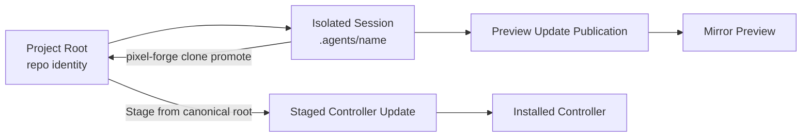
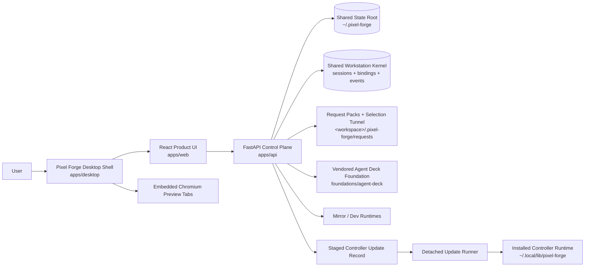
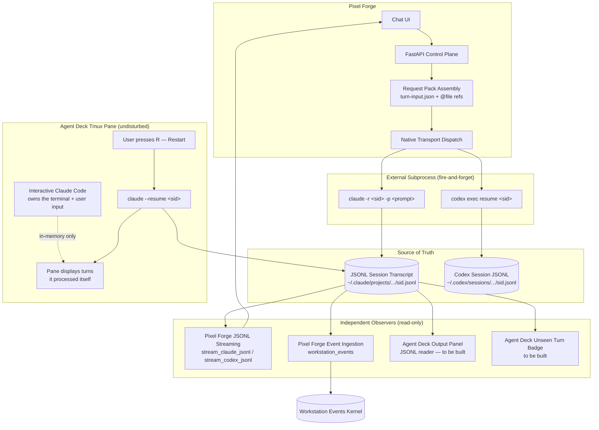
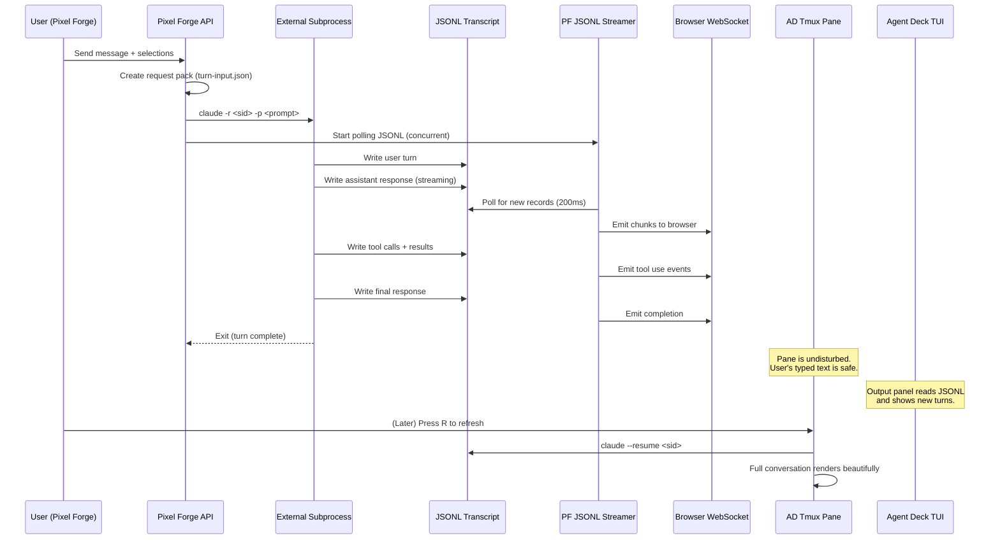
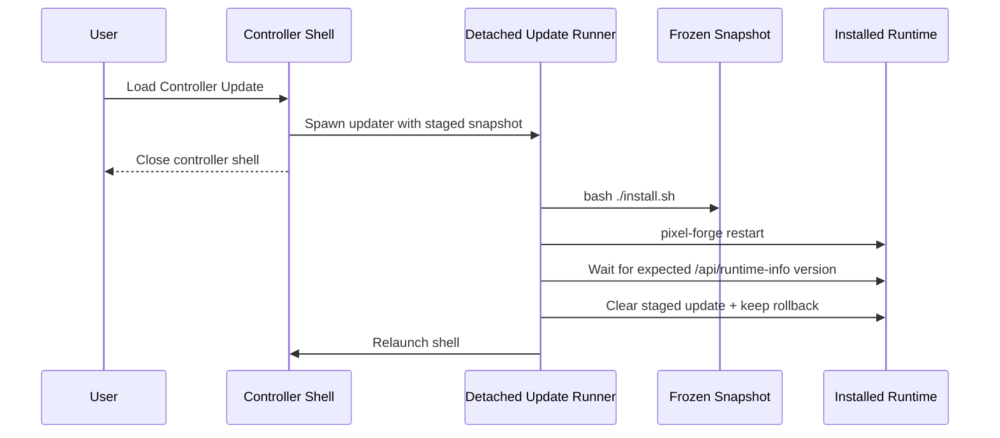
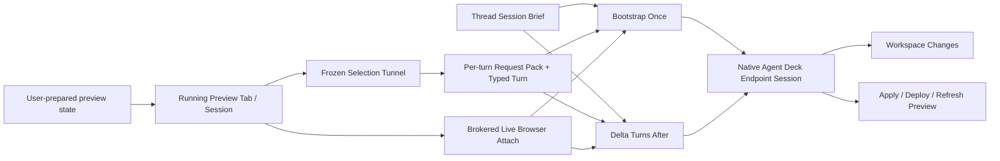
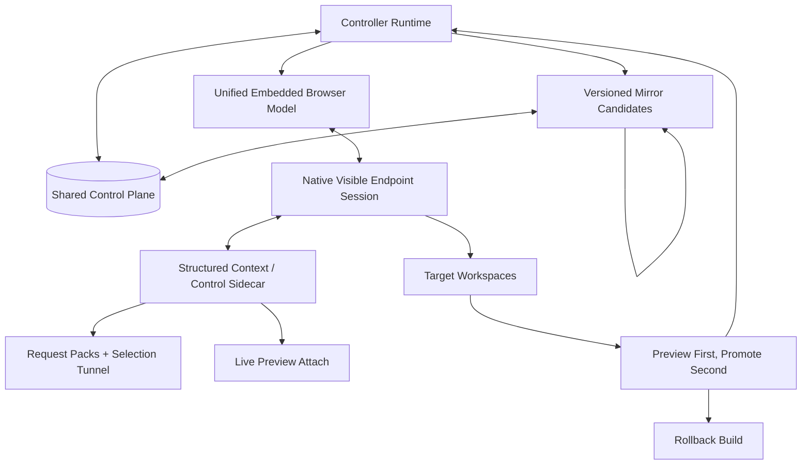

# Architecture

This is the only active repo-level architecture and operating doc.

- `INTENT.md` owns intent, goals, requirements, limiting factor, and proof status. `SPECS.md` remains only as a compatibility pointer.
- `ARCHITECTURE.md` owns current system shape, next target release shape, final ideal shape, and the operating lanes that still deserve to exist.
- `docs/adr/` owns durable design rationale that should survive implementation churn.
- `AGENTS.md` and `CLAUDE.md` should only contain non-inferable agent guardrails.
- Historical and displaced root docs live under `docs/archives/root-docs/`.

## Operating Lanes

### Development

Preferred path:

```bash
./start-dev.sh
```

That starts the dev-lane API, the Vite frontend, and auto-opens the desktop shell when a GUI display is available. This clone uses isolated defaults so the default dev lane is the `2026.4.14` runtime on `pixel-forge.localhost` with shared state under `~/.pixel-forge`.

Canonical branch for continuing this lane from a normal repo checkout or worktree:

```bash
git switch master
```

Manual fallback:

```bash
cd apps/api
python3 -m venv .venv
.venv/bin/pip install -r requirements.txt
.venv/bin/python main.py

cd apps/web
pnpm install
pnpm dev
```

### Installed Controller App

```bash
./install.sh
pixel-forge open
pixel-forge agent-deck-tui open
pixel-forge agent-deck-tui open --mirror <slug>   # attach TUI to a specific mirror's deck
pixel-forge agent-deck-tui list-mirrors           # discover mirror slugs
pixel-forge agent-deck-surface open
pixel-forge-agent-deck
```

This install lane is the canonical installed `pixel-forge` controller. It owns the integrated Pixel Forge runtime while still leaving any separately installed standalone `agent-deck` alone.

Agent Deck is a provider/runtime boundary, not Pixel Forge's internal chat architecture. Current installs may contain a Pixel Forge-owned Agent Deck provider runtime under `foundations/agent-deck`, and the provider should use that bundled runtime when it is the launch-capable command. A separately installed `agent-deck` / `agent-deck-standalone` can still be detected and used as an operator surface, but Pixel Forge must not require that external install for direct providers or for the core Live Editor shell. If neither a bundled nor external Agent Deck runtime is usable, the `agent-deck` provider is unavailable while the rest of Pixel Forge remains usable.

Direct providers such as `codex-cli` and `claude-cli` are different from Agent Deck. Pixel Forge does not own their upstream binaries, accounts, or authenticated config homes. The install and provider layers may discover common user binary paths, stage managed MCP/channel helper config, or offer an installer bootstrap where explicitly documented, but successful direct-provider use still depends on the relevant native CLI being installed and authenticated on the machine running that provider worker.

`install.sh` hashes the inputs to each expensive step (frontend build, pip install, electron install, Agent Deck Go binary, Agent Deck foundation copy) and stores the digest under `~/.cache/pixel-forge/install-cache/<instance_slug>/*.sha256`. A re-run with unchanged inputs reuses the existing artifact instead of rebuilding, and the frontend/python/desktop steps run in parallel. Measured on this repo: a no-op reinstall drops from ~60s to ~2.5s; a fresh install from ~60s to ~10s. Any source change still triggers a rebuild of only the affected step. To force a full rebuild: `rm -rf ~/.cache/pixel-forge/install-cache`.

Mirror runtimes apply the same pattern. `_ensure_mirror_runtime` in `apps/api/local_targets.py` stores cache markers under `<state_dir>/.build-cache/*.sha256` keyed by `requirements.txt` hash (pip install) and the web source tree hash (tsc + vite build).

### Agent Deck Memory Governance

Pixel Forge-owned Agent Deck provider launches use a separate runtime home and tmux socket under `~/.pixel-forge/agent-deck`. Those launches strip inherited `TMUX` / `TMUX_PANE`, set `TMUX_TMPDIR=<agent-deck-home>/tmux`, and run through `scripts/agent-deck.sh`. On Linux systems with user systemd available, that runner executes the vendored Agent Deck binary inside `pixel-forge-agent-deck.slice` with memory accounting and adaptive `MemoryHigh`, `MemoryMax`, and `MemorySwapMax` values. If systemd scope creation is unavailable, the runner falls back to the same isolated tmux socket without cgroup limits.

Default budget derivation:

- `effective_ram = min(cgroup memory.max, /proc/meminfo MemTotal)` with an 8 GiB fallback.
- `reserve = max(2 GiB, 20% of effective_ram)` for the desktop and controller.
- `agent_pool = max(1 GiB, effective_ram - reserve)`.
- `MemoryHigh = max(2 GiB, 75% of agent_pool)`, capped by `MemoryMax`.
- `MemoryMax = 90% of agent_pool`, capped to the pool.
- `MemorySwapMax = min(2 GiB, max(512 MiB, 10% of effective_ram))`.
- warm-session admission defaults to `floor(agent_pool / 2 GiB)`, clamped to 2-12 sessions.

Tuning env:

- `PIXEL_FORGE_EFFECTIVE_RAM_BYTES`
- `PIXEL_FORGE_AGENT_DECK_MEMORY_HIGH`
- `PIXEL_FORGE_AGENT_DECK_MEMORY_MAX`
- `PIXEL_FORGE_AGENT_DECK_MEMORY_SWAP_MAX`
- `PIXEL_FORGE_AGENT_DECK_MAX_WARM_SESSIONS`
- `PIXEL_FORGE_AGENT_DECK_MEMORY_SCOPE=0` to disable systemd scopes.
- `PIXEL_FORGE_AGENT_DECK_ADMISSION_CONTROL=0` to disable launch admission.

### Branch Truth

- `master` is the source branch of record for the canonical Pixel Forge lane.
- `legacy-v1` preserves the pre-cutover line that used to live on `master`.
- `dev/pixel-forge-alpha` is retired history, not an active operating lane.

### Versioning

Pixel Forge uses date-based CalVer per `INTENT.md` REQ-S-014 / REQ-S-015. Accepted tag shapes are `YYYY.M.D` (stable date tag), `YYYY.M.D-N` (same-day release ordinal, `N >= 1`), and `YYYY.M.D-beta.N` (prerelease). Ordering: `YYYY.M.D-beta.N < YYYY.M.D < YYYY.M.D-1 < YYYY.M.D-2`. SemVer MAJOR.MINOR.PATCH is not used anywhere.

Version surfaces kept in lock-step: `VERSION`, root `package.json`, `apps/web/package.json`, `apps/desktop/package.json`, `packages/sdk-node/package.json`. `scripts/check-version-sync.mjs` (invoked by `pnpm check:version` and `pnpm verify`) enforces both drift and CalVer format; UI-side comparisons use `apps/web/src/lib/calver.ts`.

The installed controller checks GitHub releases/tags through the controller API, not from the renderer as an open poll loop. The release-check cache lives in shared state as `controller-release-update.json`, stores GitHub conditional request validators (`ETag` / `Last-Modified`), and defaults automatic startup checks to a 24-hour TTL. Settings exposes a manual Check for Updates action that bypasses the TTL. The checker prefers GitHub's latest-release API when formal releases exist and falls back to the repo tag list for CalVer tags. A newer release/tag is downloaded as a source archive and staged into the existing frozen controller-update lane; applying it still uses the detached updater and remains an explicit operator action.

### Verification

```bash
pnpm verify
```

This is the canonical proof lane for version sync, shell syntax, API/desktop/web health, isolated install smoke, and staged controller-update apply/rollback smoke.

### Controller Update Management

```bash
pixel-forge controller-update stage --project /abs/path --git-ref HEAD --summary "Update ready to load"
pixel-forge controller-update status
pixel-forge controller-update apply
pixel-forge controller-update clear

pixel-forge clone promote <session> --into master --commit --push --stage
```

The installed `pixel-forge` launcher and the Pixel Forge repo-local `./pixel-forge` wrapper both dispatch to the same canonical command definition. Use `--git-ref` when the source should be an exact local commit instead of the mutable filesystem working tree. By default controller updates stage only from the canonical project root; clone workspaces under `.agents/` remain preview/edit sandboxes unless the operator explicitly overrides that policy. If the install/update lane changed after a controller update was staged, clear and restage it from current repo truth instead of applying the stale snapshot. Legacy aliases `stage-update`, `show-update`, `clear-update`, `apply-update`, and `promote-clone` still exist as compatibility shims, but the nested commands above are the canonical surface.
When developing Pixel Forge itself from the repo checkout, the repo-local `./pixel-forge` wrapper is the source-of-truth dev lane for stage/apply until the installed launcher has itself been refreshed to the latest CLI surface.
GitHub release staging is a producer for that same pending controller-update record. It may replace an older pending record only after the release archive has downloaded and validated as an installable Pixel Forge root.

## Current System Shape

- This clone is the canonical Pixel Forge dev lane. The default runtime/install identity is `2026.4.14`, `pixel-forge`, `pixel-forge-shell`, `pixel-forge.localhost`, and `~/.pixel-forge`.
- Hidden install/runtime metadata for that lane now needs to derive from the same lane identity root instead of per-surface hardcoding: service names, CLI names, URL hosts, state roots, preview partitions, and agent-facing request-pack commands should all flow from the active runtime identity config.
- The lane now carries an intentional in-workspace Agent Deck provider-runtime boundary under `foundations/agent-deck/`. `scripts/agent-deck.sh` is the single build/run boundary for that imported source, and both dev and install launchers export `AGENTDECK_PROFILE=pixel-forge` plus an isolated Agent Deck home at `~/.pixel-forge/agent-deck`.
- Pixel Forge-owned Agent Deck launches now use a Pixel Forge-scoped tmux socket, machine-adaptive memory budgets, optional systemd user scopes, launch admission control, and per-session RSS/swap/process metadata. This is the crash-protection layer for session growth; allocator trimming loops are not part of the primary strategy.
- The product path is the desktop shell over the installed FastAPI backend and built frontend.
- The dev lane now ships two separate Agent Deck operator surfaces over the same dev-owned runtime: a dedicated terminal app launcher for the real TUI and a separate web surface for browser/shell embedding.
- The dev lane now also owns one integrated Agent Deck web surface on `127.0.0.1:8422` by default. Pixel Forge can start it through `/api/agent-deck-surface`, `pixel-forge agent-deck-surface ...`, or the Settings-side operator action, and the desktop shell can open it in a second Pixel Forge window.
- The browser-only web path is a debug/service fallback, not the supported Live Editor preview surface. In that fallback, Pixel Forge-owned localhost mirrors load through the in-app proxy when possible so self-edit mirror controls do not spawn a second visible system Chrome window; remote/proxy-hostile targets can still fall back to the managed browser backend from the controller runtime. Mirror/dev target runtimes force nested preview loads through the proxy and reject nested Pixel Forge target launches at the backend boundary.
- For Pixel Forge-owned local targets, visible preview identity is now stable per workspace/source root and decoupled from the raw backend port. The controller owns that stable alias; the actual mirror/dev target port may float underneath when the documented/default port is unavailable.
- For supported repo-local workspace previews, the controller should offer deterministic candidate discovery from the bound workspace, recommend one likely app surface, launch it inside that same workspace boundary, and keep the visible preview identity stable while the real dev-server port floats underneath to avoid clone-to-clone clashes.
- The controller owns the canonical control-plane truth for this lane under `~/.pixel-forge`: projects, resumable sessions, staged controller updates, clone-scoped preview-update publications, and controller-managed mirror instance metadata. The old `~/.pixel-forge/workstation-v2` path is only a one-way migration fallback when present and can be retired after a successful reinstall.
- The shared control plane now has a first workstation-kernel slice: durable chat lanes in `sessions`, live chat-to-session bindings in `chat_session_bindings`, and append-only typed turn/activity records in `workstation_events`.
- Persisted `sessions.thread_id` remains the stable chat-id compatibility surface in this lane. Agent Deck session ids are binding metadata and lookup keys, not the primary user-facing category.
- Embedded preview input ownership is explicit controller state: visible tab, focused surface, and armed tool are separate facts. Showing a preview or arming a tool does not by itself focus the preview, and focus/show/hide input snapshots must not be treated as armed-tool changes unless the desktop event explicitly names `armedTool` as changed.
- Embedded Chromium is treated as a native viewport aperture, not as DOM content. The `WebContentsView` sits inside an inset rectangular aperture owned by the desktop shell; the React shell owns the visible border, rounded frame, menus, dialogs, and other chrome around or above that aperture. CSS `z-index` is not a correctness mechanism for stacking above the native view. When a DOM overlay intersects the preview aperture, the shell captures a fresh preview snapshot, hides the live native view, paints that snapshot in the DOM frame, and restores the live view only after the overlay clears. Native overlay windows remain appropriate for specialized desktop-owned pickers, but ordinary shell UI must never depend on the preview surface yielding to DOM stacking.
- Live Editor writes request packs into the bound workspace and dispatches through the selected provider adapter. Agent Deck sessions are one supported adapter target; direct native providers are equally valid adapter targets.
- The Projects sidebar and advanced Settings retarget control now render one reconciled Pixel Forge chat model per project. Persisted lanes remain authoritative, visible Agent Deck sessions are reconciliation inputs, unmatched live sessions are adopted into chat rows before they appear, and fresh chats are created through that same chat-facing surface as draft lanes instead of a raw-session picker.
- Visible Agent Deck session discovery remains path-truthful for rebind/delete safety, but project-scoped surfacing also honors explicit Agent Deck group ownership (`pixel-forge/<project-slug>`) for same-project or ancestor workspace contexts so intentionally grouped root-level sessions can appear under the correct Pixel Forge project without re-adopting unrelated stale sessions from a different tree.
- The sidebar is a pure project-scoped projection over the shared chat/session registry, not a reconciliation engine of its own. Every persisted chat/session/lane carries explicit owning `projectPath`, and frontend merge paths update only that owning project's registry slices instead of inferring ownership from whichever project is currently selected.
- The frontend store no longer keeps mutable flat active-project chat/session collections. `projectChatsByProject` / `projectSessionsByProject` are the registry truth, and active-project views are derived only through selectors over that registry.
- Pixel Forge now observes attached or adopted chat activity primarily through `/api/projects/{project}/chats/{chat}/events`, which streams the shared workstation event log over named SSE events into the Live Editor store.
- A single global status bus `/api/events/status-bus` streams `turn_started` / `turn_completed` / `turn_failed` across all projects and chats over one SSE connection so every sidebar row can show a truthful agent-running dot for background chats the operator is not currently observing. The bus opens with `from_now=1` so history is not replayed, self-reconnects with a cancel-on-teardown timer, and keeps the browser's six-connection-per-origin budget intact as the number of chats scales.
- Fresh Live Editor chats now start as unbound drafts. They carry only intended agent state until the first real bind. Clone-backed first bind under `.agents/` remains the default, and the draft chat composer now exposes a truthful `Clone` or `Root` choice before first send instead of hiding canonical-root bind behind API knowledge. That first-bind workspace intent must survive ordinary saved Pixel Forge thread ids and only become immutable once a real provider session binding exists.
- One Live Editor thread owns one provider lane, one default writable workspace root, and one thread-scoped editor surface: preview tabs, active target URL, viewport/tool state, selection/history state, and chat state all move together. The default self-edit mirror source follows that same bound workspace.
- Sent user prompts can now also carry a replay snapshot for recovery: when the operator needs to abandon a broken or stale lane, Pixel Forge can mint a fresh chat, restore the same selected elements and durable preview/editor state, and seed the original prompt back into the composer without auto-submitting it.
- For embedded Chromium tabs, browser navigation truth belongs to Chromium. Pixel Forge may persist recent URLs for restore/autocomplete, but the toolbar's Back/Forward state must be driven only by the BrowserView's committed navigation state rather than a parallel React cursor or replayed URL loads.
- The recent-URL picker should stay inside the Live Editor surface. It is a lightweight recall/autocomplete control, not browser history and not a desktop overlay responsibility layered over the preview.
- The shared session store persists the durable subset of that thread editor surface, including tab descriptors and restore metadata, and the UI reacquires runtime-only browser handles when a lane is reopened instead of pretending old handles survived a restart.
- The shared control-plane store also keeps one default operator profile pointer for ordinary app reopen: last active project, active mode, active Live Editor thread, and the persistent default-agent preference. Claude Code is the default until the operator changes it. Controller-update bootstrap relaunch is an override path, not the only restore path.
- If a provider session disappears outside Pixel Forge, the control-plane store detaches that dead binding from the persisted lane instead of hiding or deleting the lane. Workspace pointers and durable editor state survive; when that saved workspace still exists, the next backend reattach should target that same lane workspace rather than silently minting a second clone.
- Provider session ownership is exclusive at the Live Editor thread level. If one thread already owns a session, another thread must switch to that thread or create a different session instead of sharing the lane.
- Live Editor handoff still has bootstrap-once and delta-after continuity, but the visible transport is now tool-aware and prompt-first: the operator prompt remains intact, Claude warm turns add only direct native `@file` refs for the current turn bundle, Codex warm turns add compact context-file paths while selected images ride the native `--image` lane, and Gemini/Pi lanes launch through Agent Deck with the selected model before receiving the same request-pack refs through the Agent Deck send path. Pi local-model launches prepare the Pi Ollama provider config before launch when the selected model is `ollama/...`.
- When the upstream session IDs are known, Pixel Forge-managed warm turns dispatch through native resumed Claude/Codex subprocesses (`claude -r <sid> -p`, `codex exec resume <sid>`) which write directly to the session's JSONL transcript. The Agent Deck pane's interactive Claude Code process is never killed or disrupted by this dispatch — it continues to own the tmux pane and the operator's in-progress input. Pixel Forge and Agent Deck both observe the JSONL transcript as the shared source of truth for turn content, independent of what the pane's interactive process has rendered. Non-destructive observation surfaces should wake and refresh automatically from shared-truth events; the native pane itself remains protected from blind redraws that would clear or corrupt operator input. The current cut now uses exact transcript wakeups plus a quiet-window debounce to refresh observation surfaces immediately. For plain non-channel panes, when the pane is safely idle with an empty visible prompt, Agent Deck may still reuse the existing Restart/respawn catch-up lane automatically. Channel-enabled Claude panes are explicitly excluded from that respawn path because live March 27, 2026 operator evidence showed that forcing transcript catch-up there caused visible flashing/frozen UX while the session kept working underneath; those panes now stay on the live Channel ingress path and expose fresh transcript observation through the surrounding Agent Deck preview instead of a blind pane restart. Runtime evidence now separates the native seams more clearly: the already-running interactive Claude process watches global `~/.claude` config/state surfaces like `settings.json`, `settings.local.json`, `history.jsonl`, `state_5.sqlite`, and the `~/.claude` root, but not the per-session transcript JSONL; Claude Channels can push a new external turn into a running idle session and wake the app loop immediately when the session was launched with `--channels`; Remote Control uses a hidden `sdk-cli` child plus upstream `internal event reader/writer` plumbing over Anthropic's SDK session stream, proving internal live-sync infrastructure exists even though it is not exposed as a local external repaint hook; a March 27, 2026 local fake SDK-server probe proved that the next layer up is real for bridge-backed sessions because `event: client_event` frames on `/worker/events/stream` produced real `payload.type:"user"` turns, `/worker/events/delivery` acknowledgements, and assistant replies without stdin injection; a second PTY probe proved that simply launching `claude --sdk-url ...` interactively does not preserve the ordinary Claude terminal UI because it enters a headless `sdk-cli` lane (`installPluginsForHeadless: starting`) instead of the normal TUI; and a third same-day probe proved that even Remote Control pre-created bridge sessions are not locally adoptable into the ordinary Claude pane, because their visible `session_...` pointer, worker `cse_...` id, and the UUID surfaced in `~/.claude/sessions/<pid>.json` all fail as local `claude -r` targets. A March 27, 2026 launcher-owned harness also proved that even direct `pidfd_getfd` duplication of the live parent->child stdin bridge socket plus a valid one-line `stream-json` write does not produce a turn or transcript update, so the naive "write into the hidden bridge socket" seam is closed while the higher-level worker stream remains viable only for bridge-backed launches. That means the next search is not "invent a fake UI" but "prefer sanctioned or bridge-owned live ingress, then continuation/resume, and only then heavier orchestration or a true attach/adopt seam." This observation-layer model means the pane is a live interactive surface, not a proxy for the transport, and the JSONL is the authoritative conversation record that multiple observers can read without mutual interference.
- Stable Live Editor workflow rules live in a thread-level `session-brief.md`, while each per-turn `request.md` is now a concise human-readable mirror and `turn-input.json` is the canonical typed turn bundle for that turn.
- The chat composer now has a first-pass attachment-token model over the existing textarea: large pasted text becomes a `paste` attachment instead of a giant raw draft blob, inline `[Paste #n]` / `[Image #n]` / `[File #n]` reference tokens preserve prompt position, and chat history can expand pasted text from the attachment card. Oversized unsent paste drafts stay in renderer memory during the current app session and are encoded to data URLs only at send time so paste handling does not synchronously base64/stringify megabytes into `localStorage`. This is intentionally still a thin segment model, not yet a full rich embedded item editor or a true native multi-item upstream transport.
- The Live Editor shell treats tab descriptors and resident embedded Chromium renderers as separate resources. The UI may keep many preview tab descriptors, but the desktop shell caps live `WebContentsView` instances and suspends least-recent inactive tabs by preserving URL/title metadata and reacquiring a renderer when the tab is selected again.
- The embedded preview engine is Electron's bundled Chromium, so browser-engine updates land through deliberate Electron upgrades rather than through the operator's system Chrome/Brave version. Agent-facing live attach for embedded previews is therefore a Pixel Forge-owned CDP endpoint contract: emit `chrome-devtools-mcp --browserUrl ...` only when the Electron controller endpoint exposes a reachable page websocket for the selected warm tab.
- Chat transcript rendering is optimized for snappiness under large histories: static markdown message bodies render through memoized components, very long message bodies render collapsed until explicitly expanded, streaming output is sampled by a small dedicated stream component, autoscroll uses direct scroll positioning instead of queuing smooth scroll animations during streaming, and the Live Editor shell/input/selection surfaces subscribe only to the store slices they render so token and scroll-position updates do not re-render the whole editor.
- Startup hydration follows bounded, demand-driven loading. The first interactive Live Editor paint may restore durable tab/editor descriptors and a recent bounded chat-event window, but it must not replay the full workstation event database or block on secondary metadata like chat lists and Agent Deck target lists. Older transcript history is a progressive surface loaded by explicit user action or idle/background work after the controls are already clickable.
- Long-running Agent Deck wait loops poll session state at a slower cadence than the UI heartbeat so background completion checks do not burn CPU while the operator is clicking, typing, or switching tabs.
- Explicit slash-skill requests are promoted out of freeform user prose into `turn-input.json` and a dedicated request-pack `## Skills` section as exact skill names, while the live dispatch keeps the operator's exact slash-skill text instead of wrapping it in extra explanation.
- Slash-skill autocomplete and skill visibility come from scanning the real skill folder trees on disk: the managed Pixel Forge skill home plus external agent skill homes like Claude, Codex, Gemini, Pi, and OpenClaw. The managed Pixel Forge skill home lives under `~/.pixel-forge`, not inside the mutable app install tree, so reinstalling Pixel Forge does not wipe the skill surface.
- Mirror runtimes are isolated sibling Pixel Forge instances keyed by source snapshot or runtime root. The primary mirror-launch control binds to the isolated Live Editor workspace source and creates an isolated clone when needed.
- Mirror runtimes must not mount the controller's live DB, local-target metadata root, or Agent Deck home directly. They may be seeded from controller truth or query controller APIs explicitly, but their process-local state root, runtime dir, and self-identity host/URL must be instance-local to avoid alias recursion and self-proxy deadlocks.
- Pixel Forge deliberately does not carry forward a heuristic arbitrary-repo preview broker. The controller owns stable identity, recursion guards, and the minimal alias/proxy surface for Pixel Forge-owned local targets. For ordinary repo-local previews, Pixel Forge may support explicit deterministic candidate discovery and workspace-bound launch for common app shapes, but it should not silently infer arbitrary service lifecycle ownership from weak repo heuristics.
- Controller updates stage a frozen snapshot, optionally from an exact local git ref, through one shared CLI surface.
- Controller installs default to canonical-root sources only. Clone workspaces under `.agents/` are preview/edit sandboxes until they are promoted back into the canonical root or the operator explicitly opts into a noncanonical source.
- Clone-backed self-edit completions publish preview-only frozen snapshots scoped to the bound clone/session. Loading that update reuses the chat's primary mirror tab for that workspace by default, while still allowing separate mirror candidates to coexist when the operator opens them deliberately.
- Mirror launch follows the current chat as-is. Existing clone-backed chats mirror from their latest clone preview snapshot when one exists or from their bound workspace otherwise; existing canonical-root chats mirror from the latest staged controller snapshot when one exists or from the live controller runtime otherwise. Only brand-new draft chats default to clone creation.
- Reconciled project chats discovered from Agent Deck are first-class Live Editor lanes even before Pixel Forge has sent its own first request. Pixel Forge should not mislabel an attached adopted chat as an empty draft; selecting one hydrates the attached session's live status/output into the lane, and follow-up sends to a currently busy attached session are queued through Agent Deck rather than failing the default readiness gate.
- Non-controller runtimes do not auto-restore persisted Pixel Forge local-target tabs on startup. That guard prevents mirror-in-mirror recursion while still preserving the tab metadata for deliberate reload.
- Non-controller runtimes keep ordinary preview capability for external apps, but they do not reopen the originating Pixel Forge workspace or launch nested Pixel Forge target runtimes inside themselves. Mirror depth for Pixel Forge itself is intentionally capped at one layer.

### Simple Working Model

Use these identities consistently:

- `project root`: the canonical repo identity the operator chose
- `isolated session`: the clone-backed working copy under `.agents/<name>`
- `chat id`: the persisted user-facing lane identity; today this is the existing `sessions.thread_id` compatibility surface
- `binding`: the current chat-to-live-provider-session mapping stored separately from the durable chat row
- `workstation event`: one append-only shared-kernel event record in `workstation_events` for a chat
- `lane`: the thread-owned editor/chat state plus its eventual provider session and writable-workspace binding; draft lanes keep intended agent state before the real bind exists
- `mirror`: a runnable Pixel Forge preview built from one source root or frozen clone snapshot
- `staged update`: the frozen controller-install candidate
- `controller`: the installed runtime under `~/.local/lib/pixel-forge`

The intended loop is:



The important boundary is:

- clone creation starts from local git state, not raw working-tree copying
- request packs, direct edits, and committed selections happen in the bound thread lane workspace
- clone preview publication freezes a clone snapshot per session and reloads the primary mirror tab for that workspace by default, without removing the ability to keep multiple mirror candidates open
- controller install reads from the staged frozen snapshot, not the live repo

### Shared Kernel Slice

- `sessions` holds the durable Pixel Forge chat lanes and still owns the stable chat id.
- `chat_session_bindings` maps one chat to its current live provider session, workspace path, title, and tool. Detaching a dead session clears the binding without deleting the chat.
- `workstation_events` is the first shared event log. It now records typed Pixel Forge-managed turn events (`turn_started`, `turn_status`, `turn_chunk`, `turn_completed`, `turn_failed`), native off-path Claude and Codex turn events on that same schema, native adopted/manual-session events (`session_status`, `session_output`) for lanes that still lack turn-granular parity, and deduped compatibility `activity` snapshots only for chats that still lack any native primary workstation history.
- Pixel Forge consumes that event log through SSE for observed attached/adopted chats, so the frontend no longer depends on a chat-item polling loop as the primary truth.
- Observed chat hydration now has two explicit modes instead of one overloaded replay path: blank adopted lanes can hydrate historical observed state from the full SSE stream, while active Pixel Forge threads with existing local history tail future workstation events from the current edge only. That keeps one bound chat coherent in both directions without replaying the full observed history or dropping future off-path Agent Deck turns once local Pixel Forge messages already exist.
- The integrated Agent Deck surface reads the same control-plane DB through `PIXEL_FORGE_DB_PATH` and overlays `chatId` plus `chatTitle` onto matching Agent Deck session rows, so the second shell can show the same shared chat identity instead of only raw Agent Deck titles.
- The send path still enters through `/ws/live-editor`, and that path appends typed turn events directly into `workstation_events` as the real send/stream flow runs.
- Native Agent Deck-originated activity outside that managed path now also enters the same kernel through the foundation `events/*.json` stream, which Pixel Forge ingests into primary `session_status` plus `session_output` events for bound chats.
- Off-path Claude sessions go further: Agent Deck `hooks/*.json` plus Claude JSONL transcript deltas now promote native manual Claude activity into `turn_input`, `turn_started`, `turn_chunk`, and `turn_completed` events on the same kernel instead of leaving it as snapshot-only session state.
- When Claude hook parity is incomplete, the transcript now serves as the fallback truth for direct `entrypoint:"cli"` off-path turns: Pixel Forge emits a user-style prompt bubble from the transcript, strips the raw `<channel ...>` envelope for Claude Channel prompts, parses both block-array and plain-string `message.content` user records, completes the turn from transcript `stop_hook_summary` even when the only surviving hook snapshot is terminal `event:"Stop"`, and refuses to replay that same off-path request again after a service restart once a terminal event already exists for its stable request id. The same fallback deliberately ignores `entrypoint:"sdk-cli"` transcript turns so Pixel Forge-managed request-pack dispatch remains single-sourced.
- Off-path Codex sessions now do the same through `codex-notify` hook files plus Codex `response_item` JSONL deltas from `~/.codex/sessions/...`, including sticky session-anchor recovery when completion hooks omit `session_id`.
- Warm preview targets now expose a live-preview context lane: request packs persist `live-preview-context.json`, `/api/live-editor/live-preview-context` exposes the same lane through the canonical CLI, `context-patch.json` carries the per-turn continuation delta for warm sessions, and the captured payload now prefers rich structured live DOM state from the running preview before falling back to frozen artifacts.
- That lane now also emits exact CDP attach hints whenever the warm preview substrate exposes a reachable target websocket: DevTools browser URL, target metadata, page websocket URL, and a canonical `chrome-devtools-mcp --browserUrl ... --slim --no-usage-statistics` command for the current warm tab. The live-editor dispatch surface now surfaces the same controller browser URL and recommended command inline so agents do not have to rediscover the attach profile from JSON alone. Controller BrowserView previews still contribute controller-captured DOM state when CDP is unavailable, but they do not advertise native MCP attach unless the Electron controller endpoint is actually reachable.
- Pixel Forge now also owns a canonical live attach proof lane: when live attach hints exist, request packs and dispatch prompts give the agent exact `pixel-forge attach-proof` commands, which write `attach-proof.json` into the request pack and mirror the same receipt into `workstation_events`. That receipt now carries the canonical project identity plus an explicit `--via` mechanism, so clone-backed chats can mirror proof into the shared kernel without path drift and the artifact can say which attach path was actually used. Controller-captured live DOM facts can use that same receipt lane with `--via controller-browserview`.
- When the operator explicitly asks for real live/CDP attach proof and attach hints exist, that proof lane now requires an actual attach attempt; controller-browserview context remains useful orientation data, but it is no longer treated as a successful substitute for the requested attach proof.
- Workspace-local previews for common `package.json` app shapes can now be discovered from the bound lane workspace, recommended deterministically, started on a free port inside that same workspace boundary, and reopened through a stable controller-owned alias instead of borrowing a process-global localhost target.
- Each turn now also has one canonical typed payload in the shared kernel and request pack. `turn-input.json` is the durable artifact projection, `turn_input` mirrors the same payload into `workstation_events`, and the live dispatch string now keeps the operator prompt intact while adding only direct `@file` refs to the typed turn bundle and mirrors.
- A real operator run has now proven direct CDP attach and live control on an authenticated warm preview tab, and a fresh installed Pixel Forge rerun has now proven the repaired clone-backed attach receipt lane end to end. The next gap is no longer attach proof or typed turn assembly at Pixel Forge’s layer; it is native ingress and inspection ownership. The last mile still depends on a string turn plus direct refs and agent-side live-inspection choreography instead of one thin first-party structured bridge into the native Claude/Codex session.
- Agent Deck runtime-owned hooks, events, logs, conductor assets, update cache, and daemon env now resolve from the same dev-owned Agent Deck home instead of sharing the stable standalone `~/.agent-deck` tree.

### Next Target Shape: SaaS and Target Drivers

Pixel Forge's current Electron app is one packaging lane over a controller API and web frontend, not the final product boundary. The next architecture target is to make the same controller/web/chat kernel run in three deployment modes:

- `desktop`: local Electron shell, local controller, local workspace/provider workers, and embedded Chromium previews.
- `browser-only`: web control plane against a reachable controller, useful for debug/service operation and eventual hosted access.
- `saas`: hosted web control plane plus registered local or remote workers for workspaces, browsers, desktop apps, providers, and VMs.

That SaaS direction changes how targets should be modeled. Pixel Forge should not rely on opening Pixel Forge inside a Pixel Forge mirror as its normal debug architecture. Self-edit mirrors remain a special release, dogfooding, and regression lane. Standard app work should move behind explicit target drivers with declared capabilities:

- `browser-cdp`: attach to web apps through browser/CDP targets, capture DOM/screenshot evidence, and emit attach-proof artifacts.
- `local-app`: launch and supervise repo-local app previews from a workspace boundary without guessing arbitrary service ownership.
- `desktop-app`: drive desktop apps through OS/window accessibility or image/mouse/keyboard control where a web substrate is unavailable.
- `vm`: control isolated VM targets for installer, Windows, and cross-platform release testing through mouse/keyboard/screenshot primitives.
- `self-mirror`: run a sibling Pixel Forge mirror for the narrow self-edit lane with explicit recursion guards.

The VM lane is the preferred future standard for Windows installer and non-web app proof. It should register VM availability, boot/snapshot state, OS identity, screen geometry, input driver, and artifact paths with the controller, then write screenshots, interaction traces, install logs, and functional smoke results back into the same request-pack/workstation-event model used by Live Editor turns.

The provider kernel and the target-driver kernel should stay separate. Providers answer "which agent receives this turn and how do we observe it?" Target drivers answer "which app surface is being inspected or controlled and how do we prove it?" Keeping those boundaries separate is what lets Pixel Forge run as a desktop tool today and later as a SaaS control plane without dragging local Electron, local Agent Deck, or self-targeting mirror assumptions into every deployment.

### Project-Scoped Creative Tools

- Pixel Forge is growing a third operator surface alongside Screenshot and Live Editor: project-scoped creative authoring tools. The first instance is the Logo Forge — the recursive-tromino mark generator for Pixel Forge-family brand assets.
- The model matches how projects already own chats and sessions: switching the active project in the controller switches which save state the tool is editing. Two different Pixel Forge projects can hold two different in-progress forges and stay independent without the operator juggling files or a separate app.
- Algorithm ownership is separated from surface ownership. The pure algorithm (pattern parsing, leaf collection, color math, centering, corner-clip geometry) lives in `packages/logo-forge-core` as a UMD module with no DOM or p5 dependency, and accepts a noise function by injection. Both the standalone editor (`design/logo/tromino-forge.html`) and the future in-app tool slot consume that same package, so the two surfaces cannot drift on visual output.
- The standalone editor stays the zero-build iteration surface. It is served from repo root via `design/logo/serve.sh` so the relative `<script>` reference into `packages/logo-forge-core/index.js` resolves; export fidelity (PNG/SVG with backdrop toggle honored, rounded-rect clip) is intentionally identical to what the in-app slot will produce.
- In-app integration uses the existing project-scoped state model: Logo Forge save state (pattern, params, palette, corner radius, recursion depth, seed, preview surface and backdrop) belongs in the shared control-plane store next to the project profile that already carries active project, active mode, and active Live Editor thread. Reinstalls, controller updates, and shell restarts must keep each project's logo state intact, so browser localStorage is not an acceptable home for this state.
- The tool slot itself has not been scaffolded yet. When it lands, it extends `ActiveMode` in `apps/web/src/store/session-store.ts` from `"screenshot" | "live-editor"` to include `"logo-forge"`, adds a third pane in `apps/web/src/App.tsx` that mirrors the live-editor visibility-toggle pattern, and imports the core package directly — the pnpm workspace already wires `@pixel-forge/logo-forge-core` through the `packages/*` glob in `pnpm-workspace.yaml`. The detailed scaffolding plan (component layout, Canvas2D renderer over p5, Pixel Forge branding tokens, per-project store shape, desktop-bridge export, five-slice phasing) is pinned in `docs/adr/0003-logo-forge-tool-slot.md`.
- Background treatment is single-region, and the render canvas is always transparent. When an export includes a background, the whole frame is filled; otherwise the whole frame is transparent — gaps between shapes are exactly as transparent as the margin around the icon silhouette. The logo tool's preview-surface visualization chips (Configured / Black / White + show-background toggle) are a CSS-backed layer behind the canvas and thumbnails, not a render-time state; they never bleed into exported pixels, so selecting "White" to eyeball contrast does not alter what Save PNG / Save SVG / Download pack emit. Exports resolve their background color from the tool's Colors section and gate inclusion on one export-side checkbox.

### Agent Adapter Boundary

- Pixel Forge should have exactly one shared agent-runtime contract above the kernel and exactly one adapter per upstream agent family beneath it.
- Shared layers own the durable chat/session binding model, request-pack writing, typed turn payloads, workstation events, live-preview context, attach proof, and the operator-facing rule that one Live Editor thread targets one chosen native endpoint session.
- Per-agent adapters own only the behavior that is genuinely tool-specific: launch/resume commands, native ingress, transcript or hook parsing, readiness detection, stream adaptation, off-path ingest, and any native catch-up or repaint seam.
- The dispatcher chooses the adapter from the chat's selected agent and then stays inside that adapter for the whole turn. Claude logic must not leak into Codex or Gemini paths, Codex logic must not leak into Claude or Gemini paths, and future agents like Pi or OpenCode must arrive by registering a new adapter instead of editing mixed conditionals across the shared lane.
- Shared helper code is allowed only when the abstraction is truthful across agents. If a helper exists only because two current agents happen to need similar glue, it still belongs inside their adapters until a real shared contract emerges.

### Current Handoff Lanes

#### Native Endpoint Lane

- The selected provider owns the visible native endpoint session. Agent Deck is one provider that can host visible `claude` or `codex` sessions; direct providers can target the user's native CLI/session surface without Agent Deck.
- Pixel Forge owns visual context capture, request-pack writing, selection tunnel generation, and routing to the chosen provider session.
- Fresh chats start as draft lanes with a chosen initial agent. The chat composer may change that choice only before first send; once the real lane exists, the agent choice is immutable until a fresh chat is created.
- Fresh Agent Deck-hosted Codex lanes are launched through Agent Deck's explicit `--yolo` option, which stores Codex `yolo_mode=true` on the session and makes the raw `codex` command use `--dangerously-bypass-approvals-and-sandbox`. This is intentional for Pixel Forge-managed Codex lanes because Codex's `--full-auto` preset still allows approval prompts.
- The first dispatch into a new or rebound session may still carry stable Pixel Forge setup context through the thread brief and typed turn bundle, but the visible turn now starts with the operator's own prompt rather than a large wrapper memo.
- Later dispatches into that same session send the new operator prompt plus direct `@path` refs to the new turn bundle and mirrors while reusing the same stable thread brief behind the scenes.
- Streaming comes from the best truthful provider-owned observation path (`claude_session_id` + JSONL today for Claude).
- Codex/native non-JSONL sessions adapt the best truthful stream surface available from their provider output: real text deltas become assistant chunks, progress-only lines become status updates, and completion follows the actual provider settle state.
- When a native session still cannot provide a truthful token-like stream surface, Pixel Forge keeps using the provider's ready-gated send path, polls completion itself, and emits status heartbeats instead of treating the CLI's completion timeout as the UI truth.
- Observed attached or adopted chats now hydrate through the shared workstation event stream first; the older activity polling path remains only as compatibility glue for chats that still lack any primary workstation event history.

#### Integrated Agent Deck Surface Lane

- The second shell is the vendored Agent Deck web surface running in standalone mode against the same dev-owned Agent Deck home and the pixel-forge profile slug.
- Pixel Forge owns the launcher/runtime path for that surface and can open it from the same installed app lane instead of delegating to the stable standalone Agent Deck install.
- The surface still attaches to real tmux-backed Agent Deck sessions, but it now overlays shared Pixel Forge chat identity where a live session is bound to a saved chat.
- This lane proves two shells over one workstation foundation, but its remaining freshness gap is still in how quickly it wakes and repaints from shared truth. The target is event-driven wakeup over transcript, hook-event, and workstation-event truth with polling kept only as recovery fallback.
- The surrounding observation surfaces now also parse plain-string Claude user turns, so preview-side `Latest:` prompt summaries can acknowledge externally landed turns even when the native pane itself stays on the live-ingress lane and does not repaint that turn inline.
- Fresh installed Codex panes now also clear the startup update/trust interstitial during blank-start launch, so the integrated Agent Deck surface reaches a real Codex prompt instead of stalling on the update menu before the first Pixel Forge send. That improves readiness, but it does not change the deeper transport truth: Pixel Forge's current Codex warm-turn lane still uses `codex exec resume`, so the visible Codex pane is not yet the same thing as a live external-turn repaint surface. The preferred next Codex architecture is a dedicated Codex adapter over the official Codex app-server and remote-TUI surfaces, not reuse of Claude Channels or deeper Codex-specific conditionals in shared bridge code.

#### Integrated Agent Deck TUI Lane

- `pixel-forge-agent-deck` and `pixel-forge agent-deck-tui open` launch the real vendored Agent Deck terminal UI in a separate terminal window, with a dedicated desktop entry/WM class so it can sit side-by-side with the stable Agent Deck in the dock/app grid.
- That TUI is isolated to the dev-owned Agent Deck home/profile and is intended only for Pixel Forge integration work, not for the stable standalone Agent Deck universe.
- This keeps the operator-visible terminal app available side-by-side with the main installed Agent Deck while preventing the dev lane from borrowing or polluting the stable runtime state.

#### ACPX Sidecar Lane

- ACPX is available as a version-pinned structured runtime/control layer for experiments, legacy wrapper sessions, and future richer transport work.
- ACPX resumes ACP-created sessions well.
- ACPX is not the default continuity owner for the already-running native Agent Deck endpoint session the operator sees.

### Tooling Map

| Layer | Useful | Not Enough Yet | What Unlocks Deeper Integration |
|---|---|---|---|
| Pixel Forge request packs + selection tunnel + live preview context | Truthful frozen context, inspectable disk artifacts, stable session brief, per-turn `context-patch.json`, rich controller-captured live DOM context, CDP attach hints for the same warm session when available, durable attach receipts, stable workspace-bound preview aliases above floating ports, one typed `turn_input` payload on the shared kernel, and a prompt-first direct-`@file` transport | Native Claude/Codex still ingest that payload as a plain string turn plus refs, and deeper live inspection still depends too much on agent-side choreography | First-party live inspection surface, native context-item bridge, less prompt mediation |
| Agent Deck native sessions | Real operator control, real takeover of Claude/Codex/Gemini, session visibility | Mostly terminal/transcript surface, limited structured context injection | Better session metadata hooks, stronger transcript/event surfaces |
| ACPX 0.3.1 | Structured prompting, queueing, cancel, typed tool events, persistent ACP-owned sessions, pinned upstream foundation for future sidecar work | No proven attach/load path for an already-running native Agent Deck Claude/Codex session | Attach/import existing native agent session, context update primitives, session metadata sync |
| Pixel Forge skill/CLI | Stable agent-facing way to read frozen and live captured state | Still operator-invoked pull path instead of ambient session context | Direct artifact/context item transport on top of the same truthful capture model |

### Document-Like Selection Lane

- Pixel Forge currently handles PDFs as a selection and inspection substrate, not as true PDF object editing. The internal viewer now owns PDF semantics through an adapter boundary and projects three PDF units into the common selection engine: `pdf text` for resolved text hits, `pdf text range` for drag-highlighted text, and `pdf region` for explicit spatial fallback captures.
- The `pdf text` and `pdf text range` units now carry the real source document URL, page number, extracted text, stable text-layer anchor metadata, and frozen preview evidence. `pdf text range` additionally carries stable start/end text indexes plus offsets so the same range can be re-resolved later. `pdf region` carries the source URL, page number, normalized area bounds, nearby text when available, and frozen preview evidence. Viewer chrome is intentionally excluded from ordinary committed selections.
- The PDF adapter, not the desktop selection bridge, is now the source of truth for PDF hit-testing, range extraction, selection resolution, and reveal/replay inside the internal viewer. The desktop bridge still owns generic overlay rendering, event emission, and shared selection plumbing.
- A first replay lane now exists through active-tab selection restore: applying saved PDF selections can reveal the saved page/area/range back into the already-loaded viewer. It is still narrower than the final agent-native replay goal because it has only code-level proof so far, not fresh installed-shell visual proof.
- New document-like formats should plug into the same substrate-adapter contract instead of inventing separate operator workflows. The common tool model stays the same; each substrate only defines its native semantic units, fallback units, and replay capability.

### Upstream Capability Gap

The ideal future ACPX-backed integration does not require ACPX to replace request packs or native Agent Deck sessions. It requires ACPX to complement them.

The specific upstream capabilities that would unlock that fuller architecture are:

- attach or import an already-running native agent session instead of only resuming ACP-created sessions
- stable mapping between ACP session id and native agent session id that can be adopted after the native session already exists
- structured prompt/update or context-patch calls that let Pixel Forge send new per-turn context without replaying the full bootstrap framing
- first-class artifact/context-item references for things like selection tunnel files, live-preview context, screenshots, and preview metadata
- session-side memory or note primitives so stable Pixel Forge setup context can be written once and reused naturally across turns
- transcript/event surfaces that stay aligned with the native visible endpoint session instead of a separate hidden sidecar conversation

### Current System Diagram



### Transport Observation Layer

The transport layer follows a pure observation model. The JSONL session transcript is the single source of truth for conversation content. Multiple observers read it independently without mutual interference. The interactive Claude Code process in the Agent Deck pane is never disrupted by transport dispatch.

#### Current Transport Architecture



#### Transport Data Flow (per turn)



#### Stepping Stone: Agent Deck Observation Layer (buildable now)

Agent Deck's Output panel reads the JSONL alongside `capture-pane` to show a complete conversation view including externally-dispatched turns. The tmux pane stays undisturbed. When the operator wants to take over, they press R (Restart) and the pane catches up.

```mermaid
flowchart TB
  subgraph PF["Pixel Forge"]
    UI[Chat UI] --> API[FastAPI Control Plane]
    API --> Pack[Request Pack Assembly]
    Pack --> Dispatch[Native Transport Dispatch]
  end

  subgraph Transport["External Subprocess"]
    Dispatch --> Agent["claude -r / codex exec resume"]
  end

  subgraph Truth["Source of Truth"]
    Agent --> JSONL[(JSONL Session Transcript)]
  end

  subgraph ADObserve["Agent Deck Observation Layer"]
    JSONL --> ADPanel[Output Panel<br/>complete JSONL view]
    JSONL --> ADBadge["Unseen Turn Badge<br/>'3 new turns from Pixel Forge'"]
    JSONL --> ADStatus[Session Status<br/>detects external activity]
  end

  subgraph PFObserve["Pixel Forge Observation Layer"]
    JSONL --> PFStream[JSONL Streamer → WebSocket]
    JSONL --> PFIngest[Event Ingestion → workstation_events]
    PFStream --> UI
  end

  subgraph Pane["Agent Deck Tmux Pane"]
    Interactive[Interactive Claude Code<br/>operator's live surface]
    Interactive -.->|user types here| Draft[Staged prompt text<br/>never cleared by system]
    Refresh["User Refresh (R)"] --> Resume["--resume reloads JSONL"]
    Resume --> Interactive
  end

  style Truth fill:#2d5016,stroke:#4a8028
  style ADObserve fill:#1a3a5c,stroke:#2d6da3
  style PFObserve fill:#1a3a5c,stroke:#2d6da3
  style Pane fill:#3d2b1a,stroke:#6b4c2a
```



#### Target: Live Native-Look Agent Pane

The ideal end state is a tmux pane running the real agent app (Claude Code, Codex, etc.) where the visible experience updates in real-time as the shared transcript/event truth changes, including turns dispatched by Pixel Forge externally. The operator can type, interrupt, use slash commands, queue messages, and use all native agent features. The transcript/event stream is the shared bus; the visible pane is a live native-look view on top of it.

This requires one of three practical paths:

- **Channels path (validated live ingress, not transcript repaint):** Claude Code Channels allow an external MCP server to push `notifications/claude/channel` events into a running session, triggering a new turn in-place. This does not re-read JSONL; it injects new external-user context into the running message stream and persists it back into the session transcript as channel-originated history. Requires claude.ai auth. Research preview. On March 27, 2026 this was proven twice against a disposable idle session using the official `fakechat` channel plugin. The same day, this repo added `tools/claude-channel-spike/server.mjs`, `tools/claude-channel-spike/send.mjs`, `scripts/enable-claude-channel-spike.sh`, and opt-in Agent Deck launch/resume flags. The smallest repo-local bare-server probe is still useful as a transport proof, but on `2.1.85` it remains blocked at Claude's allowlist gate even when the MCP server connects correctly. After re-checking the official Channels docs, the launch semantics were corrected: local development must use `--dangerously-load-development-channels <entry>` directly. In that corrected shape, the plugin-backed repo-local channel `plugin:pixel-forge-channel@arc-forge` crossed the allowlist gate, logged `Channel notifications registered`, started its local HTTP ingress on a configured port, and delivered real live turns into the running Claude pane. Claude does not persist that development approval across launches, so the repo now carries a thin PTY wrapper at `foundations/agent-deck/scripts/claude_dev_channel_wrapper.py` with development auto-confirm and parent-window-size forwarding for the dev lane. Pixel Forge also now owns the bootstrap lane: `scripts/bootstrap-claude-channel-spike.sh` installs the local plugin, registers the Arc Forge marketplace entry, writes the persisted channel env into shared state, and `scripts/agent-deck.sh` sources that env automatically on future launches; `install.sh` can opt into the same flow with `PIXEL_FORGE_INSTALL_CLAUDE_CHANNEL_SPIKE=1`. This keeps the native Claude terminal UI intact while auto-crossing the known development warning for locally bundled channels. The result is narrower than an officially approved channel, but it is now a real bundled live-ingress path for local/friend deployment on individual claude.ai-authenticated accounts without requiring Team/Enterprise org controls.
- **Bridge worker path (validated live ingress for bridge-backed sessions):** Bridge-backed Claude `sdk-cli` sessions consume higher-level `event: client_event` frames on `/worker/events/stream`. On March 27, 2026 a disposable local fake SDK server that implemented `GET/PUT /worker`, `GET /worker/events/stream`, and worker POST capture injected `client_event` frames with `{event_id, event_type, sequence_num, payload}`; `payload.type:"user"` produced real `type:"user"` stdout records, `POST /worker/events/delivery` acknowledgements, `POST /worker/internal-events` user/assistant payloads, and full assistant replies without any stdin injection. This is a real ingress seam, but only for sessions launched through that bridge. A second same-day PTY probe showed that a naive `claude --sdk-url ...` interactive launch still presents itself as headless `sdk-cli` (`installPluginsForHeadless: starting`) rather than the ordinary Claude terminal UI, and a third same-day Remote Control probe showed that the bridge-managed `session_...`, `cse_...`, and exposed local UUID do not map to an adoptable ordinary `claude -r` conversation. So this seam is not yet a native-look drop-in for Agent Deck.
- **Restart/resume path (proven, current fallback for plain panes):** Agent Deck's `transcript_sync.go` watches JSONL via fsnotify, detects idle plain panes with empty composer, and triggers `Restart()` which does `tmux respawn-pane` + `claude --resume <sid>`. The new process re-reads the full JSONL and renders everything. Tradeoff: clears operator input, 1-2s cold restart. Channel-enabled Claude panes are intentionally excluded from this path because the live-ingress lane is stronger and blind respawn caused flashing/frozen UX in real operator use.
- **Upstream path:** The agent app natively watches its own JSONL transcript and re-renders when external turns appear, preserving the operator's input buffer. Anthropic has internal session-sync infrastructure (`internalEventReader`/`internalEventWriter`, bridge/Remote Control sync), but none of it is externally accessible today.

On the current evidence (March 27, 2026), the native-trigger search has been executed comprehensively. Static binary analysis, dynamic strace tracing, signal testing, hook/plugin/slash-command review, live Channels probes, Remote Control runtime inspection, launcher-owned bridge-socket injection, a local fake SDK-server bridge probe, a PTY `--sdk-url` launch probe, and a Remote Control session-adoption probe all confirm: **no mechanism in Claude Code v2.1.85 causes a running plain interactive pane to re-read its JSONL transcript from outside the process, no simple `--sdk-url` launch preserves the ordinary Claude terminal UI, and Remote Control pre-created bridge sessions are not locally adoptable into an ordinary `claude -r` pane.** Terminal tricks, signals (SIGUSR1/2, SIGURG, SIGWINCH, SIGCONT), hooks, slash commands, MCP tools, pane stdin injection, and even direct writes into the hidden Remote Control parent->child stdin socket were all tested and ruled out for that plain-pane repaint problem. The JSONL is read once at process startup into an in-memory `mutableMessages` array and never re-read. What *is* now proven is narrower and more useful: official/plugin-backed Channels are a sanctioned live ingress that wakes the running session with new external-user turns, the repo-local plugin-backed dev-bypass Channel lane is now bundled and proven on individual claude.ai-authenticated accounts, the smallest bare-server Channel route remains MCP-valid but allowlist-blocked, bridge-backed `sdk-cli` sessions also accept higher-level worker-stream `client_event` frames that create real turns, and Remote Control proves Anthropic has internal event-sync plumbing that is not locally exposed to an already-running plain tmux pane. Naive interactive bridge launch still drops into headless `sdk-cli` instead of the normal TUI, and the bridge-managed IDs still do not map back into a resumable local conversation. If no sanctioned ingress becomes generally usable for a given target, the only universal native-UI fallback remains pane-level input replay such as `tmux send-keys`, with the explicit tradeoff that it is transport-fragile and state-sensitive rather than a truthful app-level event seam.

Either path uses the same data model: transcript/events as shared truth, external subprocess dispatch for Pixel Forge turns, and the pane as a live interactive surface with full native agent capabilities.

```mermaid
flowchart TB
  subgraph PF["Pixel Forge"]
    UI[Chat UI] --> API[FastAPI Control Plane]
    API --> Pack[Request Pack Assembly]
    Pack --> Dispatch[Native Transport Dispatch]
  end

  subgraph Transport["External Subprocess"]
    Dispatch --> Agent["claude -r / codex exec resume"]
  end

  subgraph Truth["Source of Truth"]
    Agent --> JSONL[(JSONL Session Transcript)]
    PaneDispatch --> JSONL
  end

  subgraph Pane["Agent Deck Tmux Pane — Live JSONL View"]
    JSONL -->|fsnotify / file watch| Renderer[Agent-Native Renderer<br/>real-time JSONL → beautiful UI]
    Renderer --> Display[Live conversation display<br/>updates as JSONL changes]
    Input[Operator input buffer<br/>type / slash commands / interrupt] --> PaneDispatch["Dispatch via agent CLI<br/>claude -r / codex exec resume"]
    Input -.->|preserved during updates| Display
  end

  subgraph PFObserve["Pixel Forge Observation"]
    JSONL --> PFStream[JSONL Streamer → WebSocket → Chat UI]
  end

  style Truth fill:#2d5016,stroke:#4a8028
  style Pane fill:#1a3a5c,stroke:#2d6da3
  style PFObserve fill:#1a3a5c,stroke:#2d6da3
```



### Current Controller Update Flow



## Next Target Release

The next target release should attack the current limiting factor from `INTENT.md`: universal native context ingress plus live browser attach through provider-neutral agent integrations. Pixel Forge now has truthful typed turn assembly, root first-bind in the draft chat flow, prompt-first direct refs, inline attachment-token composer behavior, selection tunnels, live-preview context, and first-pass Gemini/Pi/OpenClaw parity through Agent Deck, but the final handoff still lands in Claude/Codex/Gemini/Pi/OpenClaw through tool-specific edges instead of one thin provider contract plus one universal warm-browser attach contract.

The smallest complete unit that matters:

- keep the existing persisted chat identity first-class instead of surfacing raw Agent Deck sessions as the user category
- keep the operator's prompt text exact instead of reintroducing memo wrappers
- keep draft first-bind intent explicit with the existing `Clone` or `Root` choice and lock it once the lane exists
- keep the new inline attachment-token composer model as the operator-facing truth, then translate that model into native tool inputs at the edge instead of flattening it back into wrapper prose
- carry turn context through one durable typed payload plus direct artifact refs instead of adding new prose layers
- broker one universal warm-browser attach contract that can emit the same CDP/MCP handle to Claude, Codex, Gemini, and future agents
- prove the thinner prompt-first transport and the shared live-browser attach lane in the installed shell instead of stopping at unit tests
- add one genuine native context-item lane for the highest-value artifact classes without inventing a second operator workflow
- keep `request.md` and the other request-pack files as truthful mirrors/debug artifacts rather than the conversational surface
- generalize the same item-bridge contract across DOM, PDF, image, and future document-like artifacts instead of inventing substrate-specific prompt wrappers

### Next Target Release Diagram



## Final Ideal State

The final ideal state is a boring, recursive, truthful loop:

- one embedded browser model for localhost, remote sites, and Pixel Forge itself
- one shared workstation kernel with one control plane, one event stream, one transcript model, and one chat identity
- Agent Deck as the execution and workspace kernel surface over that shared state
- Pixel Forge as the visual browser and editor shell over that same shared state
- one native visible endpoint session with a richer sidecar transport layer that can use both frozen evidence and live attach into the prepared preview session
- one promotion path from mirror preview candidate to installed controller, with rollback if needed
- recursion stays faithful because mirrors are real Pixel Forge runtimes, not special target-only surrogates

### Final Ideal State Diagram



## What No Longer Earns Active Space

- separate quick-start and setup docs
- progress or vision docs that duplicate `INTENT.md` or this file
- test-run narratives that are just historical execution logs
- root-level summaries or findings docs that are no longer operational truth

Those belong in `docs/archives/root-docs/`, not in the active root doc surface.
