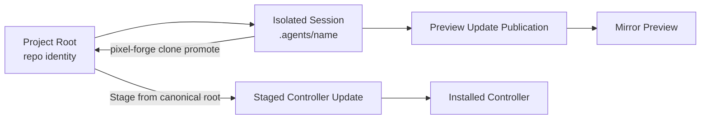
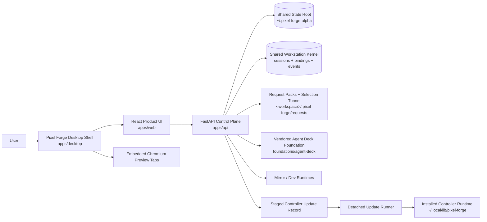
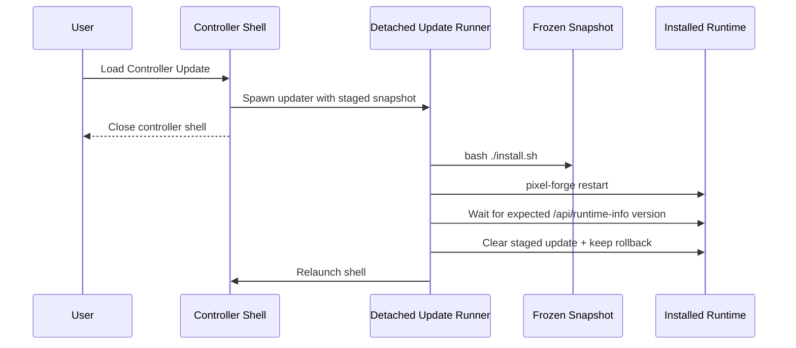
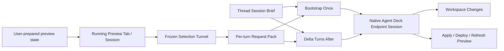
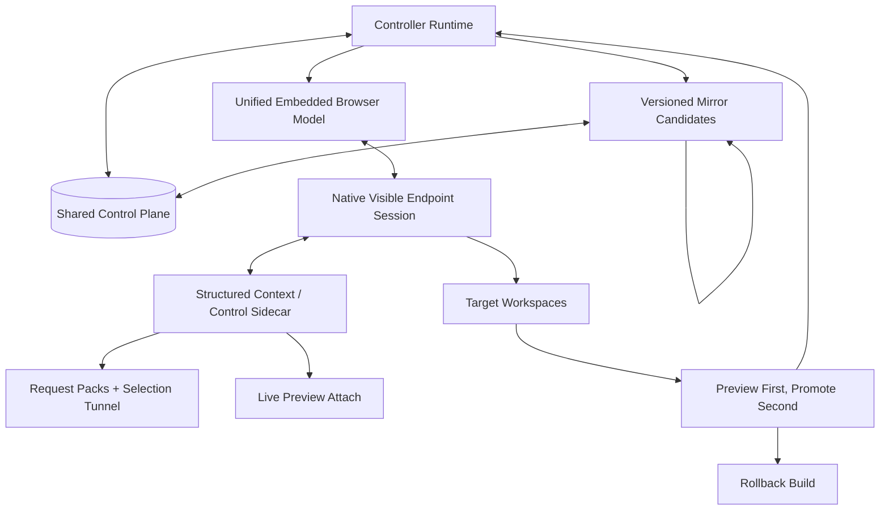

# Architecture

This is the only active repo-level architecture and operating doc.

- `SPECS.md` owns intent, goals, requirements, limiting factor, and proof status.
- `ARCHITECTURE.md` owns current system shape, next target release shape, final ideal shape, and the operating lanes that still deserve to exist.
- `docs/adr/` owns durable design rationale that should survive implementation churn.
- `AGENTS.md` and `CLAUDE.md` should only contain non-inferable agent guardrails.
- Historical and displaced root docs live under `docs/archives/root-docs/`.

## Operating Lanes

### Development

Preferred path:

```bash
./start-dev.sh
```

That starts the alpha-lane API, the Vite frontend, and auto-opens the desktop shell when a GUI display is available. This clone auto-sources `scripts/alpha-env.sh`, so the default dev lane is the isolated `2.0.0-alpha.1` runtime on `pixel-forge-alpha.localhost` with shared state under `~/.pixel-forge-alpha`.

Source branch of record for continuing this lane from a normal repo checkout or worktree:

```bash
git switch dev/pixel-forge-alpha
```

Manual fallback:

```bash
cd apps/api
python3 -m venv .venv
.venv/bin/pip install -r requirements.txt
.venv/bin/python main.py

cd apps/web
pnpm install
pnpm dev
```

### Installed Controller App

```bash
./install.sh
pixel-forge-alpha open
pixel-forge-alpha agent-deck-tui open
pixel-forge-alpha agent-deck-surface open
pixel-forge-agent-deck-alpha
```

This install lane is side-by-side. It should not replace the stable installed `pixel-forge` controller or the stable standalone `agent-deck` install.

### Branch Truth

- `dev/pixel-forge-alpha` is the source branch of record for the alpha lane.
- The earlier bootstrap clone/branch was an R&D bring-up path, not the long-term branch identity.
- Future alpha work should continue from a normal repo checkout or dedicated worktree on `dev/pixel-forge-alpha`.

### Verification

```bash
pnpm verify
```

This is the canonical proof lane for version sync, shell syntax, API/desktop/web health, isolated install smoke, and staged controller-update apply/rollback smoke.

### Controller Update Management

```bash
pixel-forge controller-update stage --project /abs/path --git-ref HEAD --summary "Update ready to load"
pixel-forge controller-update status
pixel-forge controller-update apply
pixel-forge controller-update clear

pixel-forge clone promote <session> --into master --commit --push --stage
```

The installed `pixel-forge` launcher and the Pixel Forge repo-local `./pixel-forge` wrapper both dispatch to the same canonical command definition. Use `--git-ref` when the source should be an exact local commit instead of the mutable filesystem working tree. By default controller updates stage only from the canonical project root; clone workspaces under `.agents/` remain preview/edit sandboxes unless the operator explicitly overrides that policy. If the install/update lane changed after a controller update was staged, clear and restage it from current repo truth instead of applying the stale snapshot. Legacy aliases `stage-update`, `show-update`, `clear-update`, `apply-update`, and `promote-clone` still exist as compatibility shims, but the nested commands above are the canonical surface.
When developing Pixel Forge itself from the repo checkout, the repo-local `./pixel-forge` wrapper is the source-of-truth dev lane for stage/apply until the installed launcher has itself been refreshed to the latest CLI surface.

## Current System Shape

- This clone is the dedicated alpha R&D lane. The default runtime/install identity is `2.0.0-alpha.1`, `pixel-forge-alpha`, `pixel-forge-alpha-shell`, `pixel-forge-alpha.localhost`, and `~/.pixel-forge-alpha`.
- Hidden install/runtime metadata for that lane now needs to derive from the same lane identity root instead of per-surface hardcoding: service names, CLI names, URL hosts, state roots, preview partitions, and agent-facing request-pack commands should all flow from the active runtime identity config.
- The lane now carries an intentional in-workspace Agent Deck foundation boundary under `foundations/agent-deck/`. `scripts/agent-deck-alpha.sh` is the single build/run boundary for that imported source, and both dev and install launchers export `AGENTDECK_PROFILE=alpha` plus an isolated Agent Deck home at `~/.pixel-forge-alpha/agent-deck`.
- The product path is the desktop shell over the installed FastAPI backend and built frontend.
- The alpha lane now ships two separate Agent Deck operator surfaces over the same alpha-owned runtime: a dedicated terminal app launcher for the real TUI and a separate web surface for browser/shell embedding.
- The alpha lane now also owns one integrated Agent Deck web surface on `127.0.0.1:8422` by default. Pixel Forge can start it through `/api/agent-deck-surface`, `pixel-forge-alpha agent-deck-surface ...`, or the Settings-side operator action, and the desktop shell can open it in a second Pixel Forge window.
- The browser-only web path is a debug/service fallback, not the supported Live Editor preview surface.
- For Pixel Forge-owned local targets, visible preview identity is now stable per workspace/source root and decoupled from the raw backend port. The controller owns that stable alias; the actual mirror/dev target port may float underneath when the documented/default port is unavailable.
- For supported repo-local workspace previews, the controller should offer deterministic candidate discovery from the bound workspace, recommend one likely app surface, launch it inside that same workspace boundary, and keep the visible preview identity stable while the real dev-server port floats underneath to avoid clone-to-clone clashes.
- Shared control-plane truth for this lane now lives under `~/.pixel-forge-alpha` for projects, resumable sessions, staged controller updates, clone-scoped preview-update publications, and mirror instance metadata. The old `~/.pixel-forge/workstation-v2` path is only a one-way migration fallback when present and should be retired after successful alpha verification.
- The shared control plane now has a first workstation-kernel slice: durable chat lanes in `sessions`, live chat-to-session bindings in `chat_session_bindings`, and append-only typed turn/activity records in `workstation_events`.
- Persisted `sessions.thread_id` remains the stable chat-id compatibility surface in this lane. Agent Deck session ids are binding metadata and lookup keys, not the primary user-facing category.
- Embedded preview input ownership is explicit controller state: visible tab, focused surface, and armed tool are separate facts. Showing a preview or arming a tool does not by itself focus the preview.
- Live Editor writes request packs into the bound workspace and dispatches into a persistent native Agent Deck endpoint session.
- The Projects sidebar and advanced Settings retarget control now render one reconciled Pixel Forge chat model per project. Persisted lanes remain authoritative, visible Agent Deck sessions are reconciliation inputs, unmatched live sessions are adopted into chat rows before they appear, and fresh chats are created through that same chat-facing surface as draft lanes instead of a raw-session picker.
- Pixel Forge now observes attached or adopted chat activity primarily through `/api/projects/{project}/chats/{chat}/events`, which streams the shared workstation event log over named SSE events into the Live Editor store.
- Fresh Live Editor chats now start as unbound drafts. They carry only intended agent state until the first real bind, and that first bind creates the isolated Agent Deck clone workspace under the project `.agents/` tree while the canonical repo root remains the project identity.
- One Live Editor thread owns one Agent Deck lane, one default writable workspace root, and one thread-scoped editor surface: preview tabs, active target URL, viewport/tool state, selection/history state, and chat state all move together. The default self-edit mirror source follows that same bound workspace.
- The shared session store persists the durable subset of that thread editor surface, including tab descriptors and restore metadata, and the UI reacquires runtime-only browser handles when a lane is reopened instead of pretending old handles survived a restart.
- The shared control-plane store also keeps one default operator profile pointer for ordinary app reopen: last active project, active mode, active Live Editor thread, and the persistent default-agent preference. Claude Code is the default until the operator changes it. Controller-update bootstrap relaunch is an override path, not the only restore path.
- If an Agent Deck session disappears outside Pixel Forge, the control-plane store detaches that dead binding from the persisted lane instead of hiding or deleting the lane. Workspace pointers and durable editor state survive; when that saved workspace still exists, the next backend reattach should target that same lane workspace rather than silently minting a second clone.
- Agent Deck session ownership is exclusive at the Live Editor thread level. If one thread already owns a session, another thread must switch to that thread or create a different session instead of sharing the lane.
- Live Editor handoff has two prompt shapes: bootstrap on the first turn for a new or rebound endpoint session, then delta-only framing for later turns on that same visible session.
- Stable Live Editor workflow rules live in a thread-level `session-brief.md`, while each per-turn `request.md` carries the new delta context for that turn.
- Explicit slash-skill requests are promoted out of freeform user prose into a dedicated request-pack `## Skills` section, and the dispatch wrapper treats them as invoke-now instructions instead of optional hints.
- Slash-skill autocomplete and skill visibility come from scanning the real skill folder trees on disk: the managed Pixel Forge skill home plus external agent skill homes like Claude, Codex, and OpenClaw. The managed alpha skill home lives under `~/.pixel-forge-alpha`, not inside the mutable app install tree, so reinstalling Pixel Forge does not wipe the skill surface.
- Mirror runtimes are isolated sibling Pixel Forge instances keyed by source snapshot or runtime root. The primary mirror-launch control binds to the isolated Live Editor workspace source and creates an isolated clone when needed.
- Alpha deliberately does not carry forward a heuristic arbitrary-repo preview broker. The controller owns stable identity, recursion guards, and the minimal alias/proxy surface for Pixel Forge-owned local targets. For ordinary repo-local previews, alpha may support explicit deterministic candidate discovery and workspace-bound launch for common app shapes, but it should not silently infer arbitrary service lifecycle ownership from weak repo heuristics.
- Controller updates stage a frozen snapshot, optionally from an exact local git ref, through one shared CLI surface.
- Controller installs default to canonical-root sources only. Clone workspaces under `.agents/` are preview/edit sandboxes until they are promoted back into the canonical root or the operator explicitly opts into a noncanonical source.
- Clone-backed self-edit completions publish preview-only frozen snapshots scoped to the bound clone/session. Loading that update reuses the chat's primary mirror tab for that workspace by default, while still allowing separate mirror candidates to coexist when the operator opens them deliberately.
- Mirror launch follows the current chat as-is. Existing clone-backed chats mirror from their latest clone preview snapshot when one exists or from their bound workspace otherwise; existing canonical-root chats mirror from the latest staged controller snapshot when one exists or from the live controller runtime otherwise. Only brand-new draft chats default to clone creation.
- Reconciled project chats discovered from Agent Deck are first-class Live Editor lanes even before Pixel Forge has sent its own first request. Pixel Forge should not mislabel an attached adopted chat as an empty draft; selecting one hydrates the attached session's live status/output into the lane, and follow-up sends to a currently busy attached session are queued through Agent Deck rather than failing the default readiness gate.
- Non-controller runtimes do not auto-restore persisted Pixel Forge local-target tabs on startup. That guard prevents mirror-in-mirror recursion while still preserving the tab metadata for deliberate reload.
- Non-controller runtimes keep ordinary preview capability for external apps, but they do not reopen the originating Pixel Forge workspace or launch nested Pixel Forge target runtimes inside themselves. Mirror depth for Pixel Forge itself is intentionally capped at one layer.

### Simple Working Model

Use these identities consistently:

- `project root`: the canonical repo identity the operator chose
- `isolated session`: the clone-backed working copy under `.agents/<name>`
- `chat id`: the persisted user-facing lane identity; today this is the existing `sessions.thread_id` compatibility surface
- `binding`: the current chat-to-live-Agent-Deck mapping stored separately from the durable chat row
- `workstation event`: one append-only shared-kernel event record in `workstation_events` for a chat
- `lane`: the thread-owned editor/chat state plus its eventual Agent Deck session and writable-workspace binding; draft lanes keep intended agent state before the real bind exists
- `mirror`: a runnable Pixel Forge preview built from one source root or frozen clone snapshot
- `staged update`: the frozen controller-install candidate
- `controller`: the installed runtime under `~/.local/lib/pixel-forge`

The intended loop is:



The important boundary is:

- clone creation starts from local git state, not raw working-tree copying
- request packs, direct edits, and committed selections happen in the bound thread lane workspace
- clone preview publication freezes a clone snapshot per session and reloads the primary mirror tab for that workspace by default, without removing the ability to keep multiple mirror candidates open
- controller install reads from the staged frozen snapshot, not the live repo

### Alpha Shared Kernel Slice

- `sessions` holds the durable Pixel Forge chat lanes and still owns the stable chat id.
- `chat_session_bindings` maps one chat to its current live Agent Deck session, workspace path, title, and tool. Detaching a dead session clears the binding without deleting the chat.
- `workstation_events` is the first shared event log. It now records typed Pixel Forge-managed turn events (`turn_started`, `turn_status`, `turn_chunk`, `turn_completed`, `turn_failed`), native off-path Claude and Codex turn events on that same schema, native adopted/manual-session events (`session_status`, `session_output`) for lanes that still lack turn-granular parity, and deduped compatibility `activity` snapshots only for chats that still lack any native primary workstation history.
- Pixel Forge consumes that event log through SSE for observed attached/adopted chats, so the frontend no longer depends on a chat-item polling loop as the primary truth.
- The integrated Agent Deck surface reads the same control-plane DB through `PIXEL_FORGE_DB_PATH` and overlays `chatId` plus `chatTitle` onto matching Agent Deck session rows, so the second shell can show the same shared chat identity instead of only raw Agent Deck titles.
- The send path still enters through `/ws/live-editor`, and that path appends typed turn events directly into `workstation_events` as the real send/stream flow runs.
- Native Agent Deck-originated activity outside that managed path now also enters the same kernel through the foundation `events/*.json` stream, which Pixel Forge ingests into primary `session_status` plus `session_output` events for bound chats.
- Off-path Claude sessions go further: Agent Deck `hooks/*.json` plus Claude JSONL transcript deltas now promote native manual Claude activity into `turn_started`, `turn_chunk`, and `turn_completed` events on the same kernel instead of leaving it as snapshot-only session state.
- Off-path Codex sessions now do the same through `codex-notify` hook files plus Codex `response_item` JSONL deltas from `~/.codex/sessions/...`, including sticky session-anchor recovery when completion hooks omit `session_id`.
- Warm preview targets now expose a live-preview context lane: request packs persist `live-preview-context.json`, `/api/live-editor/live-preview-context` exposes the same lane through the canonical CLI, `context-patch.json` carries the compact continuation delta for warm sessions, and the captured payload now prefers rich structured live DOM state from the running preview before falling back to frozen artifacts.
- That lane now also emits exact CDP attach hints whenever the warm preview substrate exposes them: DevTools browser URL, target metadata, and a canonical `chrome-devtools-mcp --browserUrl ... --slim --no-usage-statistics` command for the current warm tab. Controller BrowserView previews now contribute controller-captured DOM state first and CDP metadata for the same warm session when the Electron substrate exposes it.
- Pixel Forge now also owns a canonical live attach proof lane: when live attach hints exist, request packs and dispatch prompts give the agent exact `pixel-forge attach-proof` commands, which write `attach-proof.json` into the request pack and mirror the same receipt into `workstation_events`. That receipt now carries the canonical project identity plus an explicit `--via` mechanism, so clone-backed chats can mirror proof into the shared kernel without path drift and the artifact can say which attach path was actually used. Controller-captured live DOM facts can use that same receipt lane with `--via controller-browserview`.
- When the operator explicitly asks for real live/CDP attach proof and attach hints exist, that proof lane now requires an actual attach attempt; controller-browserview context remains useful orientation data, but it is no longer treated as a successful substitute for the requested attach proof.
- Workspace-local previews for common `package.json` app shapes can now be discovered from the bound lane workspace, recommended deterministically, started on a free port inside that same workspace boundary, and reopened through a stable controller-owned alias instead of borrowing a process-global localhost target.
- Each turn now also has one canonical typed payload in the shared kernel and request pack. `turn-input.json` is the durable artifact projection, `turn_input` mirrors the same payload into `workstation_events`, and the dispatch wrapper now embeds that structured turn payload directly before pointing to the disk mirrors.
- A real operator run has now proven direct CDP attach and live control on an authenticated warm preview tab, and a fresh installed-alpha rerun has now proven the repaired clone-backed attach receipt lane end to end. The next gap is no longer attach proof or typed turn assembly at Pixel Forge’s layer; it is native ingress and inspection ownership. The last mile still depends on a prompt wrapper plus agent-side live-inspection choreography instead of one thin first-party structured bridge into the native Claude/Codex session.
- Agent Deck runtime-owned hooks, events, logs, conductor assets, update cache, and daemon env now resolve from the same alpha-owned Agent Deck home instead of sharing the stable standalone `~/.agent-deck` tree.

### Current Handoff Lanes

#### Native Endpoint Lane

- Agent Deck owns the visible native `claude` or `codex` session.
- Pixel Forge owns visual context capture, request-pack writing, selection tunnel generation, and routing to the chosen Agent Deck session.
- Fresh chats start as draft lanes with a chosen initial agent. The chat composer may change that choice only before first send; once the real lane exists, the agent choice is immutable until a fresh chat is created.
- The first dispatch into a new or rebound session includes the stable Pixel Forge bootstrap framing and points at the thread's stable `session-brief.md`.
- Later dispatches into that same session send only the new request-pack reference and turn-specific context while reusing that stable thread brief.
- Streaming comes from the native agent transcript path (`claude_session_id` + JSONL today for Claude).
- Codex/native non-JSONL sessions now adapt the best truthful stream surface available from Agent Deck session output: real text deltas become assistant chunks, progress-only lines become status updates, and completion still follows the actual Agent Deck settle state.
- When a native session still cannot provide a truthful token-like stream surface, Pixel Forge keeps using Agent Deck's ready-gated send path, polls completion itself, and emits status heartbeats instead of treating the CLI's completion timeout as the UI truth.
- Observed attached or adopted chats now hydrate through the shared workstation event stream first; the older activity polling path remains only as compatibility glue for chats that still lack any primary workstation event history.

#### Integrated Agent Deck Surface Lane

- The second shell is the vendored Agent Deck web surface running in standalone mode against the same alpha-owned Agent Deck home and the alpha profile slug.
- Pixel Forge owns the launcher/runtime path for that surface and can open it from the same installed alpha app lane instead of delegating to the stable standalone Agent Deck install.
- The surface still attaches to real tmux-backed Agent Deck sessions, but it now overlays shared Pixel Forge chat identity where a live session is bound to a saved chat.
- This lane proves two shells over one workstation foundation, but its menu/status updates still rest on Agent Deck status files plus storage snapshots rather than the final native workstation event bus.

#### Integrated Agent Deck TUI Lane

- `pixel-forge-agent-deck-alpha` and `pixel-forge-alpha agent-deck-tui open` launch the real vendored Agent Deck terminal UI in a separate terminal window, with a dedicated desktop entry/WM class so it can sit side-by-side with the stable Agent Deck in the dock/app grid.
- That TUI is isolated to the alpha-owned Agent Deck home/profile and is intended only for Pixel Forge alpha integration work, not for the stable standalone Agent Deck universe.
- This keeps the operator-visible terminal app available side-by-side with the main installed Agent Deck while preventing the alpha lane from borrowing or polluting the stable runtime state.

#### ACPX Sidecar Lane

- ACPX is available as a version-pinned structured runtime/control layer for experiments, legacy wrapper sessions, and future richer transport work.
- ACPX resumes ACP-created sessions well.
- ACPX is not the default continuity owner for the already-running native Agent Deck endpoint session the operator sees.

### Tooling Map

| Layer | Useful | Not Enough Yet | What Unlocks Deeper Integration |
|---|---|---|---|
| Pixel Forge request packs + selection tunnel + live preview context | Truthful frozen context, inspectable disk artifacts, stable session brief, per-turn `context-patch.json`, rich controller-captured live DOM context, CDP attach hints for the same warm session when available, durable attach receipts, stable workspace-bound preview aliases above floating ports, and one typed `turn_input` payload on the shared kernel | Native Claude/Codex still ingest that payload through a prompt wrapper, and deeper live inspection still depends too much on agent-side choreography | First-party live inspection surface, thinner native context-item bridge, less prompt mediation |
| Agent Deck native sessions | Real operator control, real takeover of Claude/Codex, session visibility | Mostly terminal/transcript surface, limited structured context injection | Better session metadata hooks, stronger transcript/event surfaces |
| ACPX 0.3.1 | Structured prompting, queueing, cancel, typed tool events, persistent ACP-owned sessions, pinned upstream foundation for future sidecar work | No proven attach/load path for an already-running native Agent Deck Claude/Codex session | Attach/import existing native agent session, context update primitives, session metadata sync |
| Pixel Forge skill/CLI | Stable agent-facing way to read frozen and live captured state | Still operator-invoked pull path instead of ambient session context | Direct artifact/context item transport on top of the same truthful capture model |

### Document-Like Selection Lane

- Alpha currently handles PDFs as a selection and inspection substrate, not as true PDF object editing. The internal viewer renders the document and projects two selection units into the common selection engine: `pdf text` for resolved text hits and `pdf region` for spatial fallback captures.
- The current `pdf text` unit is line-like, not range-like. It carries the real source document URL, page number, extracted text, a text-layer anchor, and frozen preview evidence. `pdf region` carries the source URL, page number, normalized area bounds, nearby text when available, and frozen preview evidence. Viewer chrome is intentionally excluded from ordinary committed selections.
- The target architecture for PDFs is first-class text-range selection. Click-drag highlight should commit one semantic selection artifact for the highlighted words or lines, with combined text, stable page/range anchors, frozen evidence, and any discoverable workspace provenance such as generator or source-file hints.
- The next missing live lane is exact replay. An agent should be able to refocus the already-loaded document to the saved page/area/range and highlight it directly from the selection tunnel or live-preview context when that substrate is available. Until then, the PDF lane remains frozen evidence plus live context, not exact document replay.
- New document-like formats should plug into the same substrate-adapter contract instead of inventing separate operator workflows. The common tool model stays the same; each substrate only defines its native semantic units, fallback units, and replay capability.

### Upstream Capability Gap

The ideal future ACPX-backed integration does not require ACPX to replace request packs or native Agent Deck sessions. It requires ACPX to complement them.

The specific upstream capabilities that would unlock that fuller architecture are:

- attach or import an already-running native agent session instead of only resuming ACP-created sessions
- stable mapping between ACP session id and native agent session id that can be adopted after the native session already exists
- structured prompt/update or context-patch calls that let Pixel Forge send new per-turn context without replaying the full bootstrap framing
- first-class artifact/context-item references for things like selection tunnel files, live-preview context, screenshots, and preview metadata
- session-side memory or note primitives so stable Pixel Forge setup context can be written once and reused naturally across turns
- transcript/event surfaces that stay aligned with the native visible endpoint session instead of a separate hidden sidecar conversation

### Current System Diagram



### Current Controller Update Flow



## Next Target Release

The next target release should attack the new current limiting factor from `SPECS.md`: document-like selection fidelity. Alpha can now route PDFs into the internal viewer and commit `pdf text` or `pdf region` artifacts against the real source document, but text hit-snapping is still too fragile, the semantic text unit is still a resolved line instead of a highlighted range, and there is no first-class exact replay lane back into the warm document.

The smallest complete unit that matters:

- keep the existing persisted chat identity first-class instead of surfacing raw Agent Deck sessions as the user category
- keep the common tool/selection model substrate-driven instead of adding a PDF-only side workflow
- keep viewer chrome excluded from committed PDF selections so the document remains the only ordinary target surface
- tighten ordinary PDF clicks so meaningful text hits win before region fallback
- add one semantic `pdf text range` artifact for click-drag highlights instead of many single-line hits
- keep `pdf region` as a clearly distinct spatial fallback with page/area evidence instead of pretending it is equivalent to text
- carry exact page/range/area metadata plus frozen evidence through the selection tunnel and live-preview context
- prove one warm-document replay lane that can refocus and highlight the saved PDF page/area/range without replaying navigation manually
- generalize the same substrate-adapter contract for later document-like formats instead of inventing new operator workflows per format

### Next Target Release Diagram



## Final Ideal State

The final ideal state is a boring, recursive, truthful loop:

- one embedded browser model for localhost, remote sites, and Pixel Forge itself
- one shared workstation kernel with one control plane, one event stream, one transcript model, and one chat identity
- Agent Deck as the execution and workspace kernel surface over that shared state
- Pixel Forge as the visual browser and editor shell over that same shared state
- one native visible endpoint session with a richer sidecar transport layer that can use both frozen evidence and live attach into the prepared preview session
- one promotion path from mirror preview candidate to installed controller, with rollback if needed
- recursion stays faithful because mirrors are real Pixel Forge runtimes, not special target-only surrogates

### Final Ideal State Diagram



## What No Longer Earns Active Space

- separate quick-start and setup docs
- progress or vision docs that duplicate `SPECS.md` or this file
- test-run narratives that are just historical execution logs
- root-level summaries or findings docs that are no longer operational truth

Those belong in `docs/archives/root-docs/`, not in the active root doc surface.
