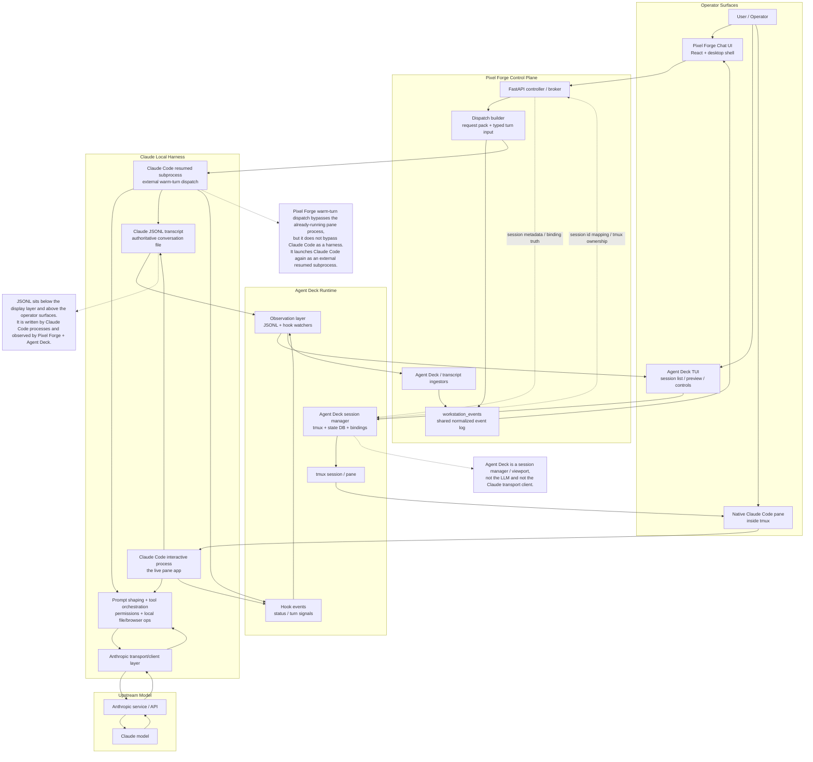

# Agent Runtime Map



## Short Glossary

- `LLM`: the remote model itself. In this path that is Claude running behind Anthropic's service.
- `Transport layer`: the client/network layer that Claude Code uses to talk to Anthropic.
- `Harness` or `agent app`: the local runtime that shapes prompts, runs tools, handles permissions, writes transcripts, and renders the terminal UI. Here that is `Claude Code`.
- `Gateway` or `control plane`: the local broker that routes work, stores bindings, and normalizes events. Here that is `Pixel Forge FastAPI`.
- `Session manager`: the local app that owns tmux sessions, launch/restart/attach, and operator scanning. Here that is `Agent Deck`.
- `Shared truth surfaces`: JSONL transcripts, hook events, and `workstation_events`.

## What Sits Between JSONL And The LLM

`Claude Code` sits between them.

The normal order is:

1. User input reaches a Claude Code process.
2. Claude Code shapes and sends that input through its transport/client layer to Anthropic.
3. The Claude response comes back into Claude Code.
4. Claude Code writes JSONL and updates the terminal UI.

Pixel Forge does **not** talk directly to the Claude model in the warm-turn path. It talks to a new Claude Code subprocess, which then talks to Anthropic.

The thing Pixel Forge bypasses is the already-running interactive pane process, not Claude Code as a product/runtime.

## Investigation Record

### What We Proved

- Pixel Forge to Claude works best when it dispatches through a resumed native subprocess instead of tmux key-send.
- The JSONL transcript is the authoritative shared-truth surface for Claude turn content.
- Agent Deck and Pixel Forge can both observe that shared truth without owning the same pane.
- Pure terminal redraws do not make the already-running Claude pane ingest externally appended history.
- A safe catch-up path does exist today: reuse Claude's own restart/resume lane when the pane is idle and the visible prompt is empty.
- The already-running interactive Claude process watches global `~/.claude` state/config surfaces, not the per-session transcript JSONL. In the disposable March 27, 2026 probe, `/proc/<pid>/fdinfo/18` for the live pane showed inotify watches on `settings.json`, `settings.local.json`, `history.jsonl`, `state_5.sqlite`, and the `~/.claude` root, while externally appended turns landed in the session JSONL without repainting the pane.
- The successful external resume path explicitly reopens and appends the session JSONL. `strace -ff` over `claude -r <sid> --print ...` showed `statx` and `openat` reads plus append writes against the session transcript file itself.

### What We Built

- Typed `turn_input`, `turn_started`, `turn_chunk`, and `turn_completed` events on the shared kernel for Pixel Forge-managed and off-path/manual Claude turns.
- Agent Deck hook-event queue ingestion into Pixel Forge so off-path Claude replies show up in Pixel Forge without manual refresh.
- Event-driven transcript freshness in Agent Deck via exact JSONL wakeups plus a quiet-window debounce.
- Transcript fallback in Pixel Forge for direct Claude `entrypoint:"cli"` off-path turns: when hook parity is missing, the ingest path now derives user-style `turn_input` plus completion from the transcript itself, while still suppressing `entrypoint:"sdk-cli"` records so Pixel Forge request-pack turns do not double-render.
- That fallback now also matches the real March 27, 2026 Claude transcript shape: plain-string user `message.content` plus a stop-snapshot-only hook file (`event:"Stop"`) are enough to backfill the complete off-path turn into Pixel Forge without a full queued hook sequence.
- That stop-snapshot fallback is now restart-idempotent too: once Pixel Forge has already recorded a terminal event for the stable off-path request id derived from the lingering `Stop` snapshot, a later service boot fast-forwards past that same transcript segment instead of replaying the whole off-path turn again.
- Automatic safe catch-up for the native Claude pane through the existing restart/respawn lane when the session is behind and the prompt is empty.
- Channel-enabled Claude panes now explicitly skip that respawn catch-up lane and rely on live Channel ingress plus observation-surface freshness instead, because real operator use showed that forcing respawn there caused repeated flashing/frozen UX while the underlying session kept progressing.
- Fresh blank-start Codex sessions in the installed alpha lane now clear the update/trust interstitial and land at a real prompt. That improves readiness, but it does not change the current Codex transport asymmetry: Pixel Forge still delivers warm turns through `codex exec resume`, so the visible pane is not yet a truthful repaint surface for externally-dispatched Codex turns.
- Codex now looks materially more promising than Claude for a future native bridge because the official runtime surface is more open and protocol-shaped. The installed CLI exposes `app-server`, `resume`, and `--remote`; `codex app-server generate-json-schema` and `generate-ts` emit first-party thread/turn protocol types like `ThreadStartParams`, `ThreadResumeParams`, `TurnStartParams`, `AgentMessageDeltaNotification`, and `TurnCompletedNotification`. That points to a better long-term Codex seam: one dedicated Codex adapter speaking the official Codex thread/turn protocol while Agent Deck hosts the real Codex UI.

### What We Tried And Ruled Out

For a running Claude pane with external JSONL drift already present, none of these caused the pane to ingest the new turn history:

**Terminal-level (ruled out 2026-03-25)**:
- `SIGWINCH`, tmux pane resize, `Ctrl+L`, `Escape`, `Right`, `Enter`, `Space` then `Backspace`

**Signal-level (ruled out 2026-03-27 via strace on disposable sessions)**:
- `SIGUSR1` — kills the process
- `SIGUSR2` — kills the process
- `SIGURG` — ignored, no JSONL re-read
- `SIGWINCH` — re-renders in-memory state only, no JSONL re-read
- `SIGCONT` — ignored, no JSONL re-read

**App-level (ruled out or blocked 2026-03-27)**:
- Hooks (`Stop`, `FileChanged`, etc.) — receive `transcript_path` but cannot trigger JSONL re-read or new turn in idle pane
- `/reload-plugins` — refreshes MCP servers, not conversation state
- `/rewind` (`/checkpoint`) — reads from in-memory checkpoints, not from JSONL
- `bridge-kick` debug command — hardcoded disabled (`isEnabled: () => !1`)
- stdin injection via `tmux send-keys` — types into the pane but does not cause JSONL re-read; the in-memory `mutableMessages` array remains stale

The missing seam for a plain interactive pane is not a terminal redraw, not a signal, not an existing hook or slash command, and not the naive hidden bridge socket. The only proven catch-up path for externally-appended transcript drift in that plain-pane mode is process restart via `--resume`, which re-reads the full JSONL. Channels are separately proven as a sanctioned live ingress, and bridge-backed `sdk-cli` sessions are now also proven to accept higher-level worker-stream `client_event` ingress.

## Most Likely Places To Find The Next Hook

### Claude-Specific Surfaces

- Claude Code continuation/resume path: this is the only proven native catch-up lane so far, which makes it the best boundary to inspect first.
- Claude Code hooks: `UserPromptSubmit`, `Stop`, and related hook events prove there is an app-level lifecycle bus already exposed for orchestration, even if it is not yet a repaint hook.
- Claude Code plugins, skills, and slash-command surfaces: these are documented extension points that may reveal how Claude re-enters or refreshes internal state without inventing a parallel UI.
- Agent SDK lifecycle and notification hooks: official SDK docs expose `SessionStart`, `SessionEnd`, `Notification`, `UserPromptSubmit`, and tool hooks. Even if the interactive pane does not expose repaint directly, the SDK shows the phases where Anthropic expects agent runtimes to intercept, observe, or resume work.
- Claude Channels: official docs describe Channels as the sanctioned way for external systems to push messages, events, and webhooks into a running Claude Code session while it is open. That makes Channels the strongest documented ingress surface for a future native catch-up design.
- Claude Remote Control: official docs say conversation history stays in sync across terminal, browser, and phone when Remote Control is active. That makes Remote Control the strongest documented hint that Claude already has an internal session-sync path beyond the plain terminal pane.

### General Cross-Agent Pattern

For any agent runtime, the likely seams are:

1. Session continuation / resume.
2. Session lifecycle notification bus.
3. Transcript or state-store invalidation.
4. Tool or permission event hooks.
5. Slash-command or command-palette entrypoints that re-enter the same internal loop.

If an agent exposes one of those, we should wrap that seam instead of building a fake replacement UI.

## Practical Recommendation

The investigation has executed steps 1-4 of the original probe plan and narrowed the search space. The answer is:

**No native seam exists in Claude Code v2.1.85 to make a plain idle pane re-read its JSONL.** The JSONL is a write-only audit log at runtime. The in-memory `mutableMessages` array is the sole source of truth for the plain interactive pane. Process restart via `--resume` is the only proven catch-up path for externally-appended transcript drift in that mode.

**A higher-level bridge ingress does exist for bridge-backed sessions.** A locally launched `sdk-cli` session pointed at a fake SDK server accepted `event: client_event` frames over `/worker/events/stream`; `payload.type:"user"` produced real `type:"user"` turns, assistant replies, `/worker/events/delivery` acknowledgements, and `/worker/internal-events` traffic without stdin injection. That is a real bridge seam, but it belongs to sessions launched through the bridge, not to an already-running ordinary tmux Claude pane.

**A naive interactive `--sdk-url` launch does not preserve the native UI contract.** Launching Claude in a PTY with `--sdk-url`, `--session-id`, and the necessary bridge env produced successful worker registration, SSE connection, and heartbeat traffic, but the debug log reported `installPluginsForHeadless: starting`, the user agent identified as `claude-code/2.1.85 (sdk-cli)`, the PTY surfaced stream-json system events instead of the normal Claude TUI, and stdin no longer behaved like ordinary operator input. So the simple "swap Agent Deck from `claude` to `claude --sdk-url ...`" idea is closed.

**Remote Control pre-created sessions are not locally adoptable into the normal Claude pane.** Running `claude remote-control --spawn=session` created a user-facing `session_...` pointer, a worker `cse_...` id, and a local bridge session registry entry in `~/.claude/sessions/<pid>.json` containing a UUID with `entrypoint:"sdk-cli"`. None of those identifiers mapped back into a resumable ordinary Claude conversation: `claude -r session_...` and `claude -r cse_...` were rejected because `--resume` only accepts UUIDs, and `claude -r <uuid>` returned `No conversation found`. No matching JSONL transcript existed under `~/.claude/projects`; the only live transcript was the bridge-owned worker log under `/tmp/claude-remote-adopt-probe/bridge-transcript-...jsonl`.

**Next concrete steps:**

1. **Keep the proven restart/resume auto-catch-up path for plain tmux panes.** Agent Deck's `transcript_sync.go` already does this well. The gap is operator input loss — document it as a known tradeoff.
2. **Promote bridge-backed worker SSE from probe to implementation candidate, but only behind a UI-contract gate.** Where Agent Deck / Pixel Forge can own the Claude launch shape, a bridge-backed `sdk-cli` lane can now truthfully ingest higher-level `client_event` messages over `/worker/events/stream` without restart. This is the thinnest validated non-stdin bridge seam, but the naive PTY launch currently fails the native-look requirement.
3. **Promote Channels from probe to implementation candidate.** Build a minimal Channel MCP server that watches shared truth and pushes `notifications/claude/channel` into sessions launched with `--channels`. This is the strongest sanctioned wake path, as long as we model it honestly as new ingress rather than transcript repaint.
4. **Treat direct attach/adopt as effectively closed unless a new upstream seam appears.** The higher-level bridge protocol is now proven, but only in sessions explicitly launched through it; the simple interactive `--sdk-url` launch has now been ruled out, and Remote Control pre-created bridge sessions do not map back into resumable ordinary Claude sessions.
5. **Extend transcript watching to Codex and Gemini.** The auto-catch-up pipeline in `transcript_sync.go` is currently Claude-only. Extending it is low-effort, high-value.
6. **Track upstream evolution.** `internalEventReader`/`internalEventWriter` and the bridge infrastructure prove Anthropic has internal session-sync primitives. Watch for external exposure.

## Official Surfaces Worth Reading

- Claude Code skills and slash-command docs: `https://code.claude.com/docs/en/slash-commands`
- Claude Code CLI reference: `https://code.claude.com/docs/en/cli-reference`
- Claude Code built-in commands: `https://code.claude.com/docs/en/commands`
- Claude Code plugins announcement/reference entrypoint: `https://claude.com/blog/claude-code-plugins`
- Claude Code hooks: `https://code.claude.com/docs/en/hooks`
- Claude Code channels: `https://code.claude.com/docs/en/channels`
- Claude Code remote control: `https://code.claude.com/docs/en/remote-control`
- Claude Code on the web: `https://code.claude.com/docs/en/claude-code-on-the-web`
- Anthropic Agent SDK hooks docs: `https://platform.claude.com/docs/en/agent-sdk/hooks`
- Anthropic Agent SDK slash commands: `https://platform.claude.com/docs/en/agent-sdk/slash-commands`
- Anthropic Agent Skills docs: `https://platform.claude.com/docs/en/agents-and-tools/agent-skills/quickstart`

## Open-Source Status

- Anthropic now maintains a public `anthropics/claude-code` repository.
- That repository is useful, but it does **not** appear to contain the main Linux CLI runtime source tree.
- The public tree currently exposes plugins, commands, examples, devcontainer files, and maintenance scripts.
- On this workstation, the installed Claude Code `2.1.85` runtime is a single ELF executable at `~/.local/share/claude/versions/2.1.85`.
- That local binary appears to be a compiled Bun/JavaScript bundle, not a normal checked-in TypeScript source tree.

Practical meaning: some Claude Code extension surfaces are open and inspectable, but the core interactive-pane runtime is still effectively a closed binary from our point of view.

## Investigation Results (2026-03-27)

Five parallel probes were executed: official-surface docs, public repo inspection, static binary analysis, dynamic runtime tracing, and cross-agent comparison. All findings below are validated unless marked otherwise.

### Definitive Architectural Finding

**The JSONL transcript is a write-only audit log during runtime, not a live sync channel.**

The Claude Code v2.1.85 binary (compiled Bun/Node.js with React/Ink TUI) follows this lifecycle:

1. **Startup**: `loadTranscriptFile()` reads the full JSONL once, parses all records into an in-memory `mutableMessages` array.
2. **Runtime**: The `mutableMessages` array is the sole source of truth for all API calls and rendering. The `hV7` message store class writes JSONL via atomic open/append/close on each turn.
3. **Shutdown**: Reads file one final time for telemetry/metadata.

The arrow from disk to memory is one-way, one-time. No signal, hook, plugin, slash command, MCP tool, or file event causes a running session to re-read the JSONL. This was confirmed by `strace -ff`, `/proc/<pid>/fd` inspection, and binary string analysis.

### Static Binary Recon Results

- **Runtime**: ELF 64-bit, 218 MB, Bun 1.2 compiled. React/Ink terminal renderer.
- **inotify watches**: `inotify_init1` and `inotify_add_watch` are imported (Bun native + libuv). Used for config hot-reload (`settings.json`, `CLAUDE.md`, `.mcp.json`), NOT for JSONL transcript.
- **No listening sockets**: All connections are outbound TCP to Anthropic API. MCP child process stdio via Unix domain socketpairs. No inbound control channel.
- **Internal bridge**: `internalEventReader`/`internalEventWriter` methods on the `hV7` message store class, used by CCR v2 cloud bridge (`initBridgeCore`). Wired at process init time, not externally accessible.
- **Debug command**: `bridge-kick` with `forceReconnect()`, `wakePollLoop()`, `injectFault()` — hardcoded disabled (`isEnabled: () => !1`).
- **Channel strings**: `notifications/claude/channel`, `notifications/claude/channel/permission`, `notifications/claude/channel/permission_request` confirmed in binary.
- **Slash commands**: `/rewind` (aka `/checkpoint`) opens a message selector but reads from in-memory checkpoints, not from JSONL. `/reload-plugins` refreshes MCP servers, not conversation state.

### Dynamic Runtime Tracing Results

- **Idle pane**: Zero JSONL re-reads. Zero inotify watches on the session JSONL file. The single inotify fd watches only `~/.claude/` config files.
- **Resume path**: Creates an entirely new process. Calls `loadTranscriptFile()` which reads the entire JSONL line by line, builds the `mutableMessages` array, passes it as `initialMessages` to the REPL component.
- **External injection**: When `claude -r <sid> -p ...` runs concurrently, the original process never detects the JSONL change. No inotify, no poll, no stat.
- **Signal tests**: SIGUSR1 kills. SIGUSR2 kills. SIGURG ignored. SIGWINCH re-renders in-memory state (no JSONL re-read). SIGCONT ignored. No signal triggers transcript reload.
- **FD audit**: fd 24 = inotify (config files only). fd 29 = `state_5.sqlite` (empty). fds 31-91 = directory handles on `~/.claude/` subdirectories for inotify watch targets.

### Candidate Seam Assessment

#### Channels (validated live ingress)

Official docs describe Channels as the sanctioned way for external systems to push messages into a running Claude Code session. An MCP server declares `capabilities: { experimental: { 'claude/channel': {} } }` and sends `notifications/claude/channel` events over stdio. The session receives these as `<channel source="name">content</channel>` tags and **starts a new turn to process them**.

Validated runtime proof:
- A disposable session launched with `claude --session-id 22222222-3333-4444-8555-666666666666 --channels plugin:fakechat@claude-plugins-official --debug-file /tmp/claude-channels-debug.log` displayed `Listening for channel messages`.
- Two separate idle-time HTTP uploads to the official `fakechat` plugin each woke the running session immediately without restart.
- The session JSONL recorded `queue-operation enqueue/dequeue`, then a `type:"user"` record with `origin.kind:"channel"` and `userType:"external"`, followed by assistant tool use and assistant text output.
- The debug log showed fresh `UserPromptSubmit`, API request, and tool-execution activity for each inbound channel message.

Constraints:
- Requires `--channels` flag at session launch (cannot be added to an already-running session)
- Requires oauth/claude.ai auth (not API key)
- Research preview, syntax may change
- Team/Enterprise must explicitly enable
- Does not re-read JSONL — injects new context into the running message stream

This is the only validated documented mechanism that can push content into a running, idle session from outside the process.

Validated local spike in this repo:
- Added `tools/claude-channel-spike/server.mjs` as the smallest local MCP server that declares `experimental: { 'claude/channel': {} }`, serves local HTTP on `127.0.0.1:8788`, and emits `notifications/claude/channel`.
- Added `tools/claude-channel-spike/send.mjs` as a tiny local sender and `scripts/enable-claude-channel-spike.sh` to generate `/tmp/pixel-forge-claude-channel-mcp.json` plus opt-in launch env for Agent Deck.
- Added opt-in Claude launch/resume flag injection in `foundations/agent-deck/internal/session/instance.go` so Agent Deck can pass `--mcp-config`, `--channels server:pixel-forge-channel`, and `--dangerously-load-development-channels server:pixel-forge-channel`.
- A disposable local session launched with those flags did connect the MCP server successfully. The debug log at `/tmp/pixel-forge-channel-spike4.debug.log` showed:
  - `MCP server "pixel-forge-channel": Successfully connected`
  - `[MCP] Server "pixel-forge-channel" connected with subscribe=false`
- Local sends were accepted by the spike server over HTTP.
- But Claude still logged:
  - `Channel notifications skipped: server pixel-forge-channel is not on the approved channels allowlist (use --dangerously-load-development-channels for local dev)`
- No `type:"user"` turn or assistant reply was created from those local sends.

Conclusion:
- official/plugin-backed Channels remain end-to-end validated
- the smallest repo-local bare `server:` route is now implemented in this repo and transport-valid
- on Claude Code `2.1.85` the bare `server:` route still stops at the allowlist gate, so by itself it is not yet a practical replacement for restart/resume

Validated plugin-backed local spike:
- Extended the same spike into a real local plugin:
  - `tools/claude-channel-spike/.claude-plugin/plugin.json`
  - `tools/claude-channel-spike/.mcp.json`
  - `tools/claude-channel-spike/package.json`
  - `scripts/install-claude-channel-spike-plugin.sh`
- The installer stages the plugin into:
  - `~/.claude/plugins/cache/arc-forge/pixel-forge-channel/0.0.1`
  - `~/.claude/plugins/data/pixel-forge-channel-arc-forge`
  - the real registered Arc Forge marketplace at `~/.claude/arc-forge-marketplace`
  - `~/.claude/plugins/installed_plugins.json`
- After correcting the marketplace path to match `~/.claude/plugins/known_marketplaces.json`, a disposable session launched with `--channels plugin:pixel-forge-channel@arc-forge` did fully resolve and connect the plugin-backed MCP server.
- The debug log at `/tmp/claude-channel-plugin4.debug.log` showed:
  - `Loading plugin pixel-forge-channel from source: "./plugins/pixel-forge-channel"`
  - `Resolved local plugin pixel-forge-channel to versioned cache`
  - `MCP server "plugin:pixel-forge-channel:pixel-forge-channel": Successfully connected`
  - `Connection established with capabilities: {"hasTools":false,"hasPrompts":false,"hasResources":false,"hasResourceSubscribe":false,"serverVersion":{"name":"pixel-forge-channel","version":"0.0.1"}}`
  - `Channel notifications skipped: plugin pixel-forge-channel@arc-forge is not on the approved channels allowlist (use --dangerously-load-development-channels for local dev)`
- The local ready file appeared:
  - `/tmp/pixel-forge-channel-plugin-ready3.json` => `{"ok":true,"host":"127.0.0.1","port":8793}`
- A local send returned `accepted`.
- No `UserPromptSubmit`, queue operation, or transcript turn followed.

Conclusion:
- the plugin-backed local route is now stronger than the bare `server:` probe because the plugin truly resolves, loads, and connects
- the remaining blocker is still the approved-channel allowlist, not packaging, marketplace lookup, or MCP transport
- official docs now clarify the dev-bypass rule: use `--dangerously-load-development-channels <entry>` directly for the channel entry you are testing; combining it with `--channels` does not extend the bypass to the `--channels` entries
- the correctly-invoked dev-flag path (`claude --dangerously-load-development-channels plugin:pixel-forge-channel@arc-forge`) is now validated end-to-end on this machine for an individual claude.ai-authenticated account
- the warning prompt is per-launch and did not persist across disposable launches; no durable acceptance marker was found in the local Claude settings or credentials files
- the first failed live probe after that was a false negative caused by a stale old Bun server still owning the default port, not by Claude rejecting the dev-bypass path; using a unique port plus ready file per probe closed that ambiguity
- the repo now carries a thin PTY wrapper at `foundations/agent-deck/scripts/claude_dev_channel_wrapper.py` so the known development warning can be auto-confirmed without replacing Claude's native UI
- the repo now also carries a bundled bootstrap lane: `scripts/bootstrap-claude-channel-spike.sh` installs the plugin, registers the local Arc Forge marketplace, writes a persisted shared-state env file, and `scripts/agent-deck-alpha.sh` auto-sources that env on future launches
- the earlier Arc Forge marketplace corruption warning was caused by our own incomplete marketplace record writer, not by Claude rejecting the channel path; after fixing `lastUpdated` in `scripts/install-claude-channel-spike-plugin.sh`, a fresh wrapper-owned smoke on session `dddddddd-eeee-4fff-9000-444444444444` rendered `← pixel-forge-channel: Pixel Forge clean installer smoke probe` and a full assistant reply without the warning

#### internalEventWriter (discovered, not exploitable)

The `hV7` message store has `setInternalEventReader(H)` and `setInternalEventWriter(H)` methods. The `onInboundMessage` callback can push messages into the live session. Used by the CCR v2 cloud bridge. Requires being inside the process — no external trigger. This confirms Anthropic has the concept of runtime message injection but does not expose it externally.

#### Remote Control (runtime-observed upstream sync infrastructure)

Official docs say conversation history stays in sync across terminal, browser, and phone when Remote Control is active. Runtime inspection now confirms that this is backed by bridge infrastructure beyond the plain terminal pane. A disposable `claude remote-control` server created a bridge environment, then spawned a hidden `sdk-cli` Claude child with `--sdk-url`, `--input-format stream-json`, `--output-format stream-json`, and `--replay-user-messages`. That child logged `CCR v2 internal event writer registered for transcript persistence` and `internal event reader registered for session resume`.

What this proves:
- Anthropic has a real internal live-session event stream and transcript persistence bridge.
- Remote Control is not based on the terminal pane re-reading local JSONL.

What it does not prove:
- there is a supported local external API to kick that bridge for Agent Deck / Pixel Forge
- there is a way to make an already-running plain terminal Claude pane adopt that bridge without launching through Remote Control

Additional runtime boundary:
- A launcher-owned harness was able to duplicate the live Remote Control parent->child stdin socket with `pidfd_getfd` and write a valid one-line `stream-json` user event into it.
- The kernel accepted the write.
- The bridge transcript did not change, no assistant turn appeared, and launch-time `strace -ff` over the spawned `sdk-cli` child showed no corresponding `read(0, ...)` or output activity attributable to the injected event.

Conclusion:
- the hidden bridge socket is real and writable
- but it is not a usable steady-state local ingress seam for waking the running `sdk-cli` child
- any future Remote Control exploitation would need to target a higher-level bridge protocol, not a raw stdin socket write

#### Higher-level worker SSE `client_event` (validated for bridge-backed sessions)

A disposable March 27, 2026 local fake SDK server proved the higher-level bridge protocol is live and writable above the raw socket layer. The server implemented:

- `GET /worker`
- `PUT /worker`
- `GET /worker/events/stream`
- `POST /worker/events`
- `POST /worker/internal-events`
- `POST /worker/events/delivery`

The locally launched command was:

```bash
~/.local/share/claude/versions/2.1.85 \
  --print \
  --sdk-url http://127.0.0.1:45187/v1/code/sessions/local-probe4 \
  --session-id local-probe4 \
  --input-format stream-json \
  --output-format stream-json \
  --replay-user-messages
```

Validated sequence:

- The worker registered successfully and logged `CCR v2 internal event writer registered for transcript persistence`, `internal event reader registered for session resume`, and `SSETransport: Connected`.
- Injecting `event: client_event` frames with JSON `{event_id, event_type, sequence_num, payload}` into `/worker/events/stream` was accepted by the client.
- A minimal frame with `payload.type:"user"` and ordinary `message.role/content` produced:
  - `SSETransport: Event seq=1 ... payload_type=user`
  - an echoed `type:"user"` stdout line
  - a full assistant reply (`BRIDGE SSE MIN OK`)
  - `POST /worker/events/delivery` acknowledgement for `evt-1`
  - `POST /worker/internal-events` user and assistant payloads
- A richer `payload.type:"user"` frame with `userType:"external"` and `entrypoint:"sdk-cli"` produced the same behavior (`BRIDGE SSE EXT OK`).
- A `payload.type:"keep_alive"` frame was accepted and surfaced as a keep-alive event, proving non-user bridge payloads also traverse the stream.

This validates a real higher-level live ingress seam for bridge-backed Claude sessions. It does **not** change the plain-pane conclusion: an already-running ordinary tmux Claude pane still has no external JSONL repaint hook.

#### Naive interactive `--sdk-url` launch (validated bridge, failed UI contract)

Validated sequence:

- A disposable PTY launch used `--sdk-url http://127.0.0.1:54845/v1/code/sessions/interactive-probe --session-id 33333333-4444-4555-8666-777777777777 --debug-file /tmp/claude-bridge-interactive-server/interactive.debug.log` plus bridge env (`CLAUDE_CODE_ENVIRONMENT_KIND=bridge`, `CLAUDE_CODE_SESSION_ACCESS_TOKEN`, `CLAUDE_CODE_POST_FOR_SESSION_INGRESS_V2=1`, `CLAUDE_CODE_USE_CCR_V2=1`, `CLAUDE_CODE_WORKER_EPOCH=1`).
- The fake server observed real worker setup and liveness:
  - `GET /worker`
  - `PUT /worker`
  - `GET /worker/events/stream`
  - repeated `POST /worker/heartbeat`
- The debug log proved the client entered CCR v2 bridge mode:
  - `SSETransport: Connected`
  - `CCR v2 internal event writer registered for transcript persistence`
  - `CCR v2 internal event reader registered for session resume`
- The same debug log also proved the UI lane was not the ordinary Claude terminal experience:
  - `installPluginsForHeadless: starting`
  - transport user agent `claude-code/2.1.85 (sdk-cli)`
- The PTY did not render the normal Claude UI. It surfaced stream-json system events instead.
- Plain-text stdin and even a valid stream-json user line did not behave like normal operator input.

This closes the naive bridge-launch hypothesis: `claude --sdk-url ...` is not currently a native-look drop-in replacement for Agent Deck's ordinary Claude pane.

#### Remote Control session adoption (validated failed attach path)

Validated sequence:

- `claude remote-control --spawn=session --debug-file /tmp/claude-remote-adopt-probe/remote.debug.log` in the repo cwd created bridge pointer `session_019eY2BH4jpobGqwRgtgQUpS`.
- The Remote Control debug log then polled work item `cse_019eY2BH4jpobGqwRgtgQUpS` and spawned child args:
  - `--print --sdk-url https://api.anthropic.com/v1/code/sessions/cse_019eY2BH4jpobGqwRgtgQUpS`
  - `--session-id cse_019eY2BH4jpobGqwRgtgQUpS`
  - `--input-format stream-json`
  - `--output-format stream-json`
  - `--replay-user-messages`
- The worker stream emitted a local UUID in `/tmp/claude-remote-adopt-probe/bridge-transcript-cse_019eY2BH4jpobGqwRgtgQUpS.jsonl`:
  - `session_id:"b63edbd9-eed2-4ff5-8034-e119408e4a77"`
- Claude also wrote local registry file `/home/samuelrodda/.claude/sessions/1689311.json`:
  - `{"pid":1689311,"sessionId":"b63edbd9-eed2-4ff5-8034-e119408e4a77","cwd":"...","kind":"interactive","entrypoint":"sdk-cli"}`
- Attach tests:
  - `claude -r session_019eY2BH4jpobGqwRgtgQUpS --print ...` failed because `--resume` only accepts UUID-format ids
  - `claude -r cse_019eY2BH4jpobGqwRgtgQUpS --print ...` failed for the same reason
  - `claude -r b63edbd9-eed2-4ff5-8034-e119408e4a77 --print ...` returned `No conversation found with session ID`
- A filesystem search found no corresponding transcript under `~/.claude/projects`; the only live transcript artifact was the bridge-owned worker log under `/tmp/claude-remote-adopt-probe`

This closes the simple Remote Control adoption hypothesis: the bridge-managed session is real, but it does not expose an ordinary locally resumable Claude conversation that Agent Deck can simply attach to.

### Cross-Agent Comparison

| Feature | Claude Code v2.1.85 | Codex CLI v0.117.0 | Gemini CLI v0.34.0 |
|---------|---------------------|---------------------|---------------------|
| Session format | JSONL (user/assistant records) | JSONL (Responses API protocol) | Single JSON (messages array) |
| Headless into existing session | YES (`-r <sid> -p`) | PARTIAL (`resume <thread>` plus open app-server protocol) | NO (-p = new session) |
| File watching own transcript | No | No | No |
| Hooks | 8 event types, mature | Under development, disabled | 6 event types, mature |
| Resume for catch-up | `--resume <sid>` | `codex resume <thread>` | `--resume <sid>` |
| Official live ingress / bridge surface | Channels and bridge-backed worker SSE | Open app-server + remote TUI + typed thread/turn protocol | None proven yet |

**Key asymmetry**: Claude is the only runtime in this repo that already has a validated in-place live ingress for the ordinary running pane. Codex now appears easier to integrate cleanly in the next phase because it exposes a more open first-party control surface (`app-server` + remote TUI + typed thread/turn protocol), but that lane has not yet been wired into Pixel Forge. Gemini still looks the weakest of the three from a native-ingress point of view.

**Reusable across all agents**: tmux session management, restart/resume catch-up, fsnotify transcript watching, prompt detection, hook-based status sidecar.

**Claude-specific**: JSONL as shared writable truth, `-r <sid> -p` dispatch, auto-catch-up pipeline in `transcript_sync.go`.

### What Remains

1. **Default-vs-opt-in decision**: The local plugin route is now bundled and deployable on individual accounts, so the open product question is no longer packaging. It is whether the dev-bypass + wrapper lane should remain opt-in or become Pixel Forge's default Claude install path.
2. **Fallback comparison against `tmux send-keys`**: Keep the comparison honest. `tmux send-keys` is still the only universal native-UI fallback across agents, but it is input replay with race conditions, prompt-state ambiguity, and pane-focus quirks. Channels stay preferable wherever a sanctioned ingress is actually usable.
3. **Upstream watch**: The `internalEventReader`/`internalEventWriter` pair and the bridge infrastructure prove Anthropic has internal session-sync primitives. Track whether these become externally accessible.
4. **Codex-native bridge spike**: Build a dedicated Codex adapter spike around the official app-server and remote-TUI surfaces instead of deepening `codex exec resume` or mixing Codex logic into Claude's channel lane.
5. **Cross-agent transcript watch**: Extend `transcript_sync.go` to watch Codex rollout files and Gemini JSON files, not just Claude JSONL. This gives all agents event-driven stale detection and automated catch-up where no stronger native ingress exists.
